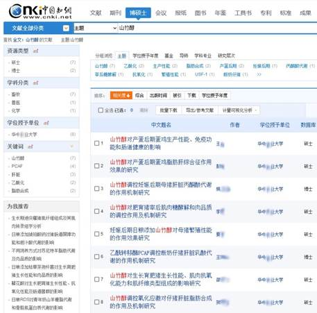
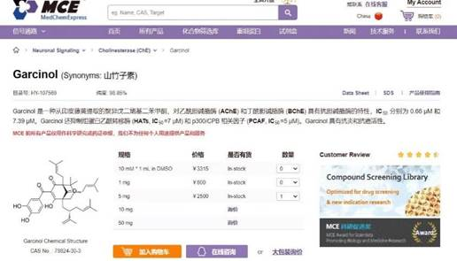
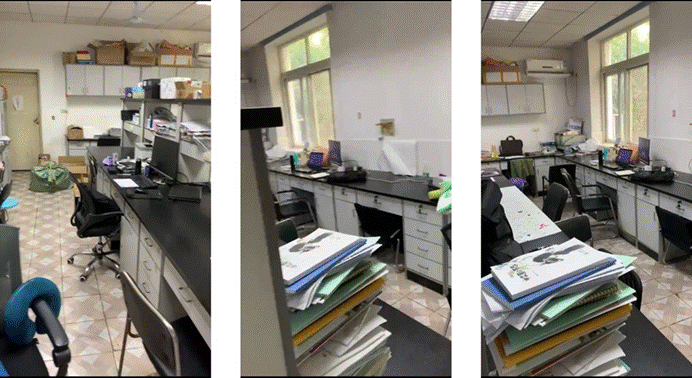

# 1   前言

各位朋友大家好！本文中所涉及的人物，我们并未透露真实姓名。也许有些人会感到疑惑，为何我们都进行实名举报了，却不敢指名道姓？这是因为黄教授曾在课题组组会上多次讲过：“不要在网络上发表任何言论”、“我背后有学校年薪 50 万的专业律师团队”、“你就算在网上发表了，别人都是来看笑话的”。对于黄教授的这些话，我们不做评价，但是我们坚信，无论是网友还是学校、学院都会站在正义的一方。这次举报这不是出于某个人的泄愤， 而是出于我们集体不屈服于学术造假的态度和决心。全文只讲逻辑和事实，对因为于以下的全部言论、图片和表格，我们都确保其真实性、可靠性，并附上链接、附件等材料供所有人查看及核实。
或许大家对黄某若教授还不够了解，简单来说，他可以被称为“植物提取大师”或“表观遗传学专家”。黄教授以其招牌植物提取物——“山竹醇”（英文名为 Garcinol）而闻名，撑起了其发表论文的半壁江山。在知网以“山竹醇”为关键词搜索到的学位论文，几乎全部来自于黄教授的指导（图 1-1-1）。仅从这些学位论文的题目就可以看出，山竹醇能够全方位改善断奶仔猪、肥育猪、妊♘后期母猪、产蛋后期蛋鸡的性能，涉及生长性能、繁殖性能、肉品质等多个方面，可谓十分全能。这样的“全能”添加剂自然是价值不菲，仅 1 毫克纯度为 98.85%的“山竹醇”售价高达 800 元（图 1-1-2）。

 *图 1-1-1 截取自中国知网*

 *图 1-1-2 纯度为 98.85%山竹醇（Garcinol）纯品的购买价格（来自网络）*

如此高昂的价格促使着黄教授带领团队一直致力于山竹醇的提取工艺优化和寻找含有高浓度山竹醇的鲜果。从一开始黄教授宣称山竹醇来源于“山竹果皮”，再到“大叶藤黄”、 “印度藤黄”等，连来源都捉摸不定的物质，寻找合适的果实并进行提取和检测自然并非易事。这项工作历经好几届学生的参与，人人叫苦不迭。然而，当我们终于找到“可能合适” 的果实，并联系好卖家准备大量购买时，黄教授总是突然说：“后面的事情不需要你们联系了”，“那边公司已经买了几百斤了”，“工厂那里都是现代化的提取设备不需要你们动手提取了”。可是最终，我们连提取物的影子都没有见到。
虽然未见到实际的提取物，但是有关山竹醇的“实验”一直在进行中。黄教授课题组近几年也算是比较“高产”的课题组了，山竹醇的 SCI 论文发了个遍。当然这里也就必须提到黄教授的“左膀右臂”——王某心博士和姚某磊博士。目前两位博士已经成功进站，就职于华中某业大学担任黄教授课题组的博士后。两位博士确实具备极高的“学术水平”，人在电脑前坐着，SCI 文章就能不断发表了。无论是往届毕业生还是在读的同门，从没有哪个人见过两位师兄做实验，也从没有人听说过两位师兄下过场。当然，黄教授常常会口述两位师兄做实验和下场实践的“光荣事迹”，比如在浙大做分子实验、养细胞多么规范认真，在哪个猪场养了好几百头猪，在哪个公司养了很多小鼠一批一批的在造模。那一定是很辛苦的事吧， 毕竟要进行“隐秘的实验”，实属不易。
然而，在黄教授课题组想要正正经经地做实验更难。在此，我们十分羞愧地向大家展示课题组曾经的实验条件。许多本科生可能对读研后的生活怀有憧憬，满怀对科研的热爱和做好实验的决心，我们当然也一样。但面对着狭小的“实验自习室”和约等于无的实验条件的时候，总会感到十分挫败。下图展示的是 2022 年之前黄教授课题组的“ 实验室”+“ 自习室”（图 1-1-3），在这个约 20 平方米的房间里，需容纳坐下 20 多名学生，同时还充当“实验室”的角色。因为我们没有独立的实验空间，如果一定要说有的话，可能就只有那个 4 平方米的细胞间了。而在这房间里，你也很难看到有什么实验设备。头顶的架子里，放的也都是多年前的试剂和耗材，许久未有人使用。但在如此艰苦的条件下，实验室每年仍能产出几篇实验性的 SCI 论文。

 *图 1-1-3 2022 年及以前黄教授课题组“实验室”+“自习室”*

2022 年年底学校新实验楼的建成，让我们拥有了独立的自习室和实验室，也重新燃起了希望。本以为先前的窘境将不复存在，大家终于可以认认真真做科研了。然而，新环境并没有带来新气象，我们仍然面临着众多难题。首先是实验仪器的缺失，最基本的分析天平都没有，频繁借到连学院的高 S 老师都忍不住吐槽过：“你们实验室能不能置办点基础的实验设备，这也没有那也没有的”、“你们黄老师不是很有钱吗，啥也舍不得买”等等，别的基础的分子实验包括 PCR、WB 等自然我们也都无法开展。毕竟黄教授的名言是：“没有哪个课题组是什么仪器都有的”、“学院的仪器共享平台上都有”，甚至还怂恿学生自掏腰包去给老师送礼。退一万步讲，我们可以去平台上借仪器，但试剂呢？我们总得配好试剂过去做实验吧，然而买试剂耗材这种事我们根本不能自行订购，想进行细胞实验的同学也不会给你买细胞，都是想办法自行去借。有趣的是，很多不明真相的同学，看到我们实验室经常没有人， 还会羡慕地跟我们说：“你们组真好，都不用做实验直接送检”，但个中苦涩实难与他人道也。
既然实验难以进行，那么实验结果又是从何而来？答案显而易见——编造实验数据。这种方法耗时少、花费少、结果好、产出高，自然成了某些人的首选。为什么我们课题组很少有本校的人来读研？为什么自己组的同学都不愿意转博？为什么有博士仅入学三个月就退学？是可忍孰不可忍，此等行径我们怎能听之任之？因此，我们联合起来实名举报黄教授的诸多不当行为。这些年黄教授不仅指导多名学生进行严重地学术造假，而且存在克扣学生劳务费、打压学生等多重行为。接下来我们将分章节展开说明，并且将相应原文的页码也标注出来，以便大家核对。
