## 2.1   王某心博士

> [乙酰转移酶PCAF调控断奶仔猪肝脏乳酸代谢的作用机制研究 - 中国知网 (cnki.net)](https://kns.cnki.net/kcms2/article/abstract?v=0qMDjMp0v1m2Fg0kelYyjnycLkm6-cp79Y9WKmrpF8ZhGaxqD8v40T3Ggd2UAS06hLdDvEambT9R-1i-a4sWY6bCmvhSKs022ZJe9eIyxEzXDTyOjO2xg_yHtoKsR_h2KOPGHJX52fQ9aY7q1D8akw==&uniplatform=NZKPT&language=CHS)

王博士是黄教授毕业的第一个博士，仅在博士四年期间就以第一作者身份发表 SCI 论文十一篇，其中还有一篇论文发表在《Journal of Hepatology》，这些成果也让他轻松获得了包括“国家奖学金”在内的多项荣誉。离奇的是我们从未看见过王博士亲手做过任何实验， 鸡猪的文章发个遍也从没见过其下场实践。那么到底其是掌握了什么样的科研“技巧”，才能成为其他老师口中的“标杆”呢，让我们一起来学习一下。

### 2.1.1   学位论文与 Journal of Hepatology 论文比较

首先我们将着重对比其以共同第一作者身份发表于《Journal of Hepatology》的题为《Acetylation of lactate dehydrogenase B drives NAFLD progression by impairing lactate clearance》（这部分中简称 Paper 1），及学位论文《乙酰转移酶 PCAF 调控断奶仔猪肝脏乳酸代谢的作用机制研究》（在 2.1 部分中简称学位论文）。
在其 Paper 1 中，其 Fig 2 的图 H 展示了高脂日粮喂养 4 周、12 周和 28 周小鼠 LDHB 和 LDHA 的代表性蛋白表达（见 P 1042），而在其学位论文的 3.4.4 节中的图 2-12 A 展示了断奶应激下仔猪肝脏乳酸脱氢酶的乙酰化规律分析 （见 P 47）。将两张 WB 图结果进行对比后可以发现，其用于学位论文中描述仔猪肝脏中蛋白表达结果的 WB 图，是截取于 HFD 小鼠 12W 和 28W 的结果。同样的一张 WB 图结果，王博士想描述成猪或者是小鼠真是随心所欲，为自己想要的结果而服务（图 2-1-1）。

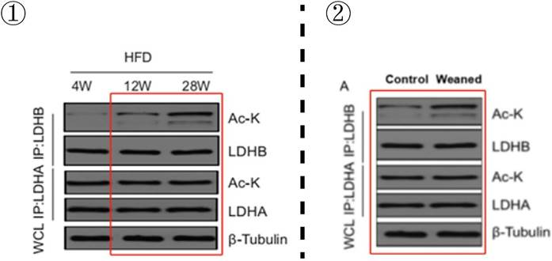

 *图 2-1-1 图①为其 Paper 1 中 HFD 小鼠中蛋白表达结果，图②为其学位论文仔猪肝脏中蛋白表达结果（感兴趣的可以调高此图对比度和亮度，结果更直观）。*

同样的“技巧”还可见于其 Paper 1 的 Fig. 2 中图Q（见 P 1042）以及学位论文 3.4.5 小节中的图A（见 P 48），运用相同的截图手段，王博士再次“移鼠接猪”，成功地将 HFD 小鼠肝脏中的蛋白表达结果转换成了仔猪肝脏中的蛋白表达结果（图 2-1-2）。

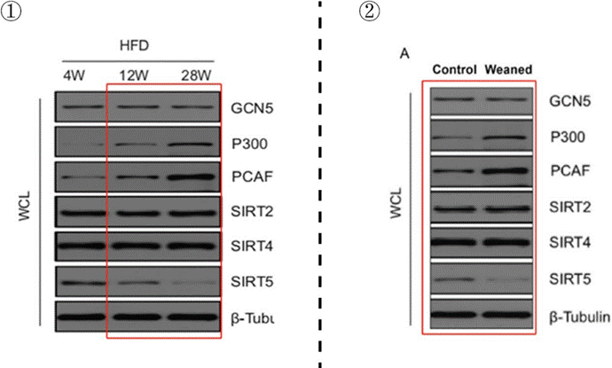

 *图 2-1-2 图①为 Paper 1 中 HFD 小鼠肝脏中蛋白表达结果，图②为学位论文仔猪肝脏中蛋白表达结果（感兴趣的可以调高此图对比度和亮度，结果更直观）。*

类似地，Paper 1 的 Fig. 5 中图O（见 P 1048）以及学位论文第四章 3.6 小节中的图 4-10 B （见 P 78），不同阶段的老鼠用了同样的 IKKβ 的 WB 结果，第二个条带的小白点一模一样（图 2-1-3)。

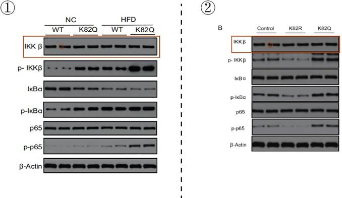

 *图 2-1-3 图①为 Paper 1 中 6-8 周龄野生型小鼠肝脏中蛋白表达结果，图②为学位论文断奶小鼠肝脏中蛋白表达结果。*

诸如此类的问题还有很多，其 Paper 1 的 Fig. 2 中 R-W 展示了小鼠肝脏中各种蛋白水平（见P 1042），在学位论文 3.4.5 小节中图 2-12 B-G 展示了的仔猪肝脏中各种蛋白水平（见 P 48），王博士再次巧用 “移鼠接猪”，在鼠和猪这两个不同的物种上检测的水平、数值甚至显著性惊人的一致（图 2-1-4）。

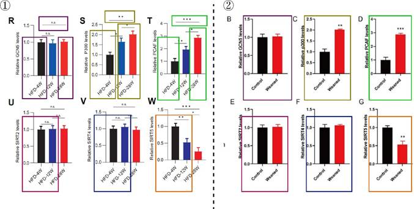

 *图 2-1-4 图①为 Paper 1 中 HFD 小鼠肝脏中各种蛋白水平，图②为学位论文仔猪肝脏中各种蛋白水平（为便于大家观察，左右相对应的结果以同样的颜色框起来）。*

我们发现 Paper 1 中描述 HFD 小鼠肝脏 LDHB 和 LDHA 乙酰化水平的 Fig. 2 J 和 L（见P 1042），对应学位论文第三章 3.2 小节中描述仔猪肝脏 LDHB 和 LDHA 乙酰化水平的图 3- 2 B 和C （见 P 58）（图 2-1-5）；Paper 1 中描述 HFD 小鼠肝脏LDHB 和 LDHA 活性的 Fig. 2 M （见 P 1042），对应学位论文第三章 3.2 小节中描述仔猪肝脏 LDHB 和LDHA 活性的图 3- 2 的B（见 P 58）（图 2-1-6）。

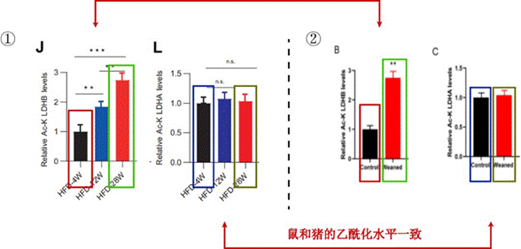

 *图 2-1-5 图①为 Paper 1 中 HFD 小鼠 LDHB 和 LDHA 的乙酰化水平，图②为学位论文仔猪肝脏中 LDHB 和 LDHA 的乙酰化水平。*

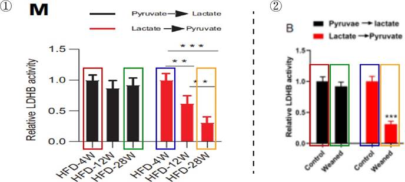

 *图 2-1-6 图①为 Paper 1 中 HFD 小鼠 LDHB 和 LDHA 的活性，图②为学位论文仔猪肝脏中LDHB 和 LDHA 的活性。*

此外，Paper 1 的Fig. 1 A 展示了 NASH 和NAFL 肝脏乙酰化水平显著变化的一些蛋白（见P 1042），在学位论文第二章 3.4.2 小节中图 2-9 展示的则为仔猪肝脏中乙酰化水平显著变化的一些蛋白（见 P 45），有趣的是，在将两张图等比例尺进行还原后，我们发现变化倍数是一模一样的，改动的主要是纵坐标的描述，而且从部分相同的描述中依稀还能找到一些“曾经的痕迹”（图 2-1-7）。

 *图 2-1-7 上图为原图，其中①在 Paper 1 中描述为 NASH 和 NAFL 肝脏中乙酰化水平显著变化的 16 个蛋白，②为学位论文中仔猪肝脏中乙酰化水平显著变化的 16 个蛋白。*
下图为调整为等比例尺后的图片（图 2-1-8)。

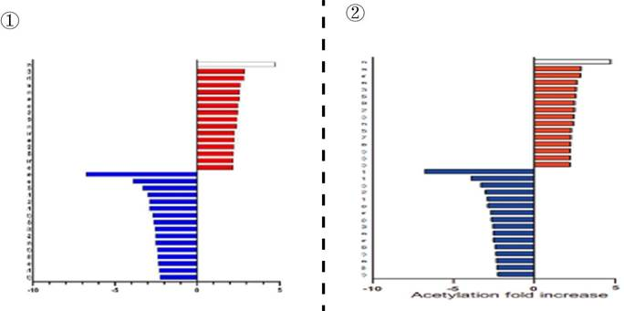

 *图 2-1-8 上图为调整为等比例尺后的图片，可以看出是完全相同的结果。*

而在 Paper 1 附加材料的 Figure S1 展示了 NASH 和NAFL 肝脏 LDHB 赖氨酸乙酰化位点的表征，在学位论文第二章 3.4.3 小节中图 2-10 断奶仔猪肝脏 LDHB 赖氨酸乙酰化位点的表征（见 P 46），王博士再次物尽其用，将图片重复进行使用（图 2-1-9）。

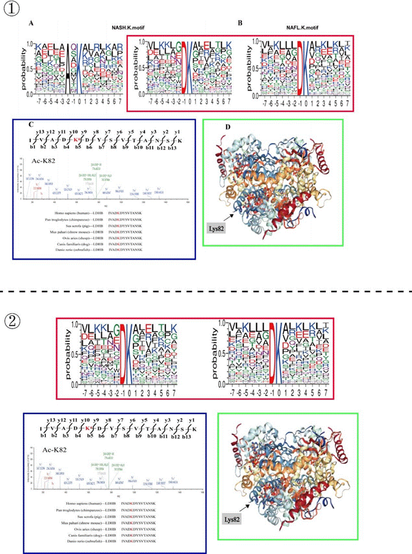

 *图 2-1-9 图①为 Paper 1 中 NASH 和 NAFLD 患者肝脏 LDHB 赖氨酸乙酰化位点的表征，图② 为学位论文中断奶仔猪肝脏 LDHB 赖氨酸乙酰化位点的表征。*

此外，对于本篇文章，我们还有一个小小的疑问，据其描述，“All human samples were collected under protocols approved by the National Natural Science Foundation of China with informed patient consent obtained prior to their inclusion in this study（所有人体样本都是根据国家自然科学基金委员会批准的方案收集的，并在纳入本研究前获得了患者的知情同意)”。而参与了人体样品采集的同学则表示：样品是在患者手术中的时候，由医生提供的，疑似未
经患者知情。因此我们敬请王博士和黄教授提供所有患者的知情同意书。

### 2.1.2   学位论文与 AJP Endocrinology and Metabolism 论文比较

这部分将把王博士以第一作者身份发表于《AJP Endocrinology and Metabolism》的题为
《Acetyl-CoA from inflammation-induced fatty acids oxidation promotes hepatic malate-aspartate shuttle activity and glycolysis》（这部分中简称 Paper 2），与其学位论文进行比较。首先对 Paper 2 背景进行介绍，在材料方法的高亮部分，描述了实验选用的猪体重约为 30 kg，实验组的猪经过 LPS 处理。在学位论文中选用的则是平均初始体重为 5.83±0.27 kg 的断奶仔猪（图 2- 1-10）。而在进行比较后，两篇文章中不同阶段且不同处理的猪，多处使用了同一结果。不过相比于“移鼠接猪”，这次取得了明显的进步，起码物种相同了。

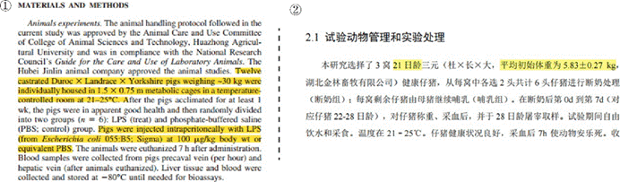

 *图 2-1-10 图①为其 Paper 2 中实验动物描述，图②为其学位论文实验动物描述*

首先还是 WB 的实验结果部分，在 Paper 2 的Fig. 1 中图H 展示的对照组和 LPS 组肝脏蛋白表达情况 （见 P E500），与学位论文第二章中 3.3.2 小节图 2-5 展示的断奶应激对仔猪肝脏糖脂代谢途径关键酶蛋白表达的影响存在多处重复用图现象（见 P 41）（图 2-1-11)。

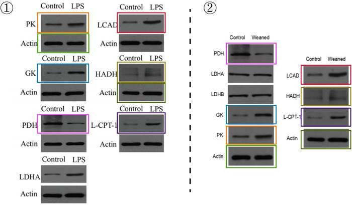

 *图 2-1-11 图①为 Paper 2 中 LPS 猪肝脏蛋白表达情况，图②为其学位论文断奶仔猪肝脏蛋白表达情况（对应部分用相同颜色框出）。*

类似地，肝脏中乙酰辅酶 A 的含量也能对应起来（分别对应 Paper 2 的 Fig. 1 G 以及学位论文 P 40 的图 2-4 A）（图 2-1-12）。

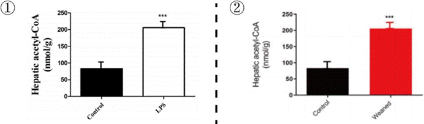

 *图 2-1-12 图①为 Paper 2 中 LPS 猪肝脏中乙酰辅酶 A 的含量，图②为其学位论文断奶仔猪肝脏中乙酰辅酶 A 的含量。*

此外，30 kg 且经过 LPS 处理的猪与断奶仔猪的肝脏定量乙酰化蛋白组学分析结果完全一致即共用一张图片（分别对应 Paper 2 的 Fig. 3 以及学位论文 P 43 的图 2-7），做的改动仅仅是把 C 图和D 图换了个位置而已（图 2-1-13），造假造得改都懒得改了，无他，唯手熟尔。

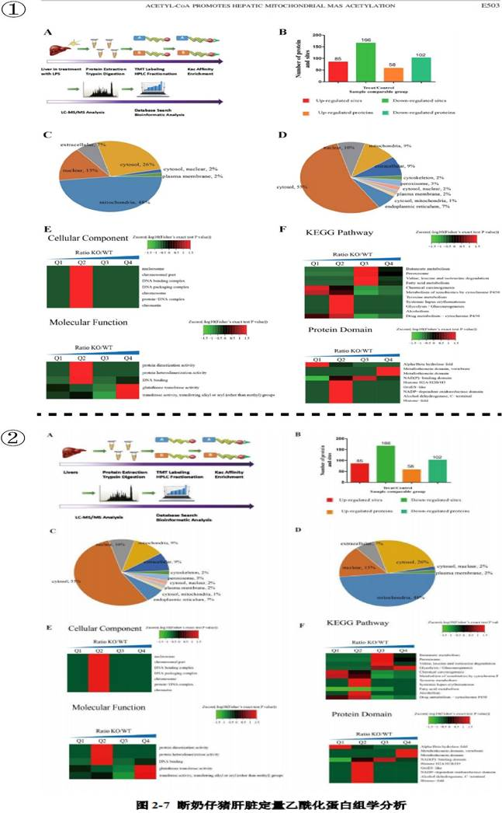

 *图 2-1-13 图①为 Paper 2 中 LPS 猪肝脏定量乙酰化组学分析，图②为学位论文断奶仔猪肝脏定量乙酰化组学分析（原图清晰度不够）。*

而在血清/血液多种物质浓度的结果中同样发现了雷同现象。如图 2-1-14 所示，图①是Paper 2 中Fig. 1 的图 C-E （见 P E500），分别显示了阉割公猪在 LPS 处理后不同时间点血清非酯化脂肪酸（NEFA）、葡萄糖和乳酸的浓度；图②是其博士论文中第二章 3.1 节中图 2-1的 A-C （见 P 37），分别展示了断奶应激对仔猪血液糖脂代谢产物含量（NEFA、葡萄糖和乳酸）的影响。将这两张图进行对比可以发现，尽管猪的阶段和处理都不相同，但是不同的猪体内这些物质的浓度及其变换却高度一致。

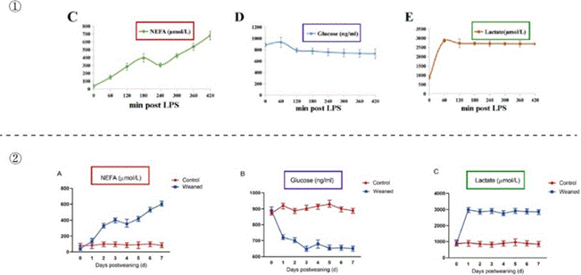

 *图 2-1-14 图①为阉割公猪 LPS 处理后各时间点各物质的浓度，图②为仔猪断奶后各物质浓度的变化*

### 2.1.3   学位论文中的其他“小问题”

根据其学位论文第三章 3.3.1.5 小节部分中的结果描述（P 62）（图 2-1-15）： “结果显示，将 PCAF 在肝细胞中过表达会显著提高 LDHB（K82）野生型的乙酰化水平（P<0.05）（图 3-7 A）”，再看图 3-7 A 的实际结果用的是 Flag-SIRT5，中文版图注描述为“ （A）过表达 SIRT5的肝细胞中的 LDHB-K82 乙酰化和蛋白质水平”，英文版图注描述为“ （A）LDHB-K82 acetylation and protein levels in hepatocytes overexpressing PCAF （即过表达 PCAF）”； “而过表达 SIRT5 没有引起 LDHB 乙酰化水平的变化（P>0.05）（图 3-7 B）”，再看图 3-7 B 的实际结果用的是 Flag-PCAF，中文版图注描述为“ （B）敲低 SIRT5 的肝细胞中的 LDHB-K82 乙酰化和蛋白质水平”，英文版图注描述为“ （A）LDHB-K82 acetylation and protein levels in hepatocytes overexpressing SIRT5（即过表达 SIRT5）”。
最后一句话介绍 K82R 和 K82Q 的乙酰化水平均没有受到 PCAF 和 SIRT5 过表达的影响（P>0.05），而在我们用 Image J 进行灰度值分析后，发现图 B 中 K82Q 的乙酰化水平数值差异较大，疑似存在差异。

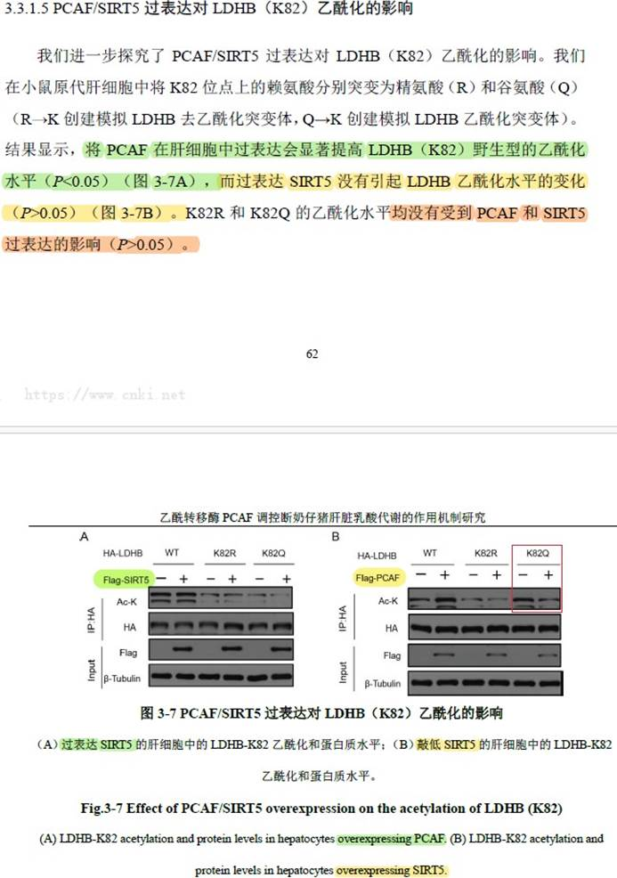

 *图 2-1-15 绿色部分据其描述为“PCAF 过表达”的相关结果；黄色部分据其描述为“SIRT5 过表达”的相关结果*

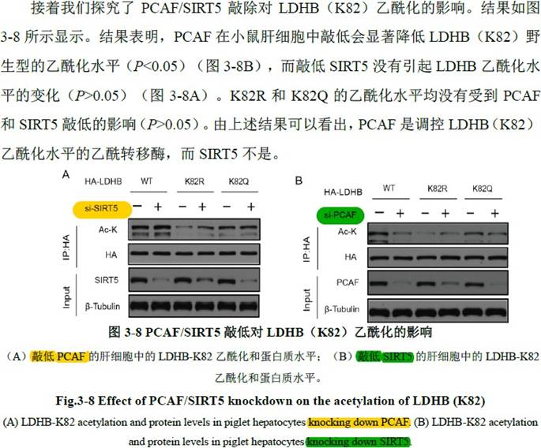

 *图 2-1-16 选自学位论文第三章 3.3.1.5 小节。黄色部分为沉默 SIRT5 WB 结果及其图注；绿色部分为沉默 PCAF WB 结果及其图注。*

学位论文第三章 3.3.1.5 小节部分中的结果描述同样有误（P 62）（图 2-1-16），图 A 使用的 si-SIRT5，图注标的是敲低 PCAF；图 B 使用的 si-PCAF，图注标的是敲低 SIRT5。
在其 Paper 1 和学位论文（见 P 60）中 SIRT5 与 LDHB 的共聚焦分析部分，我们发现共聚焦结果展示的 Hepa1-6（  小鼠肝癌细胞）和 Porcine Hepatocyte（  猪肝细胞）的图片能严丝合缝拼接到一块（图 2-1-17）。

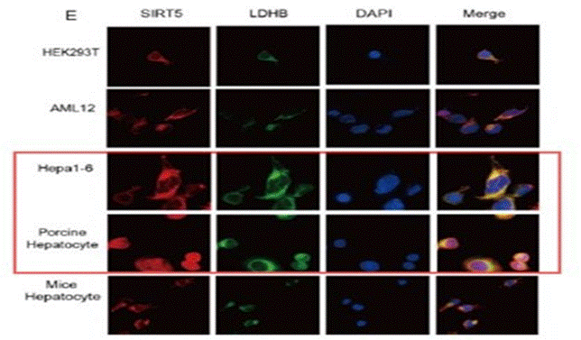

 *图 2-1-17 Paper 1 和学位论文中 SIRT5 与 LDHB 的共聚焦分析*

根据其学位论文第四章对实验动物的描述（见 P 72），选用的是 ICR 雄性断奶小鼠 （百度百科对其品种特征的第一句话描述就是“毛色白化”）（图 2-1-18），而在其 3.1 部分断奶小鼠模型的建立中，我们可以看到使用的是小黑鼠（ 应该是C57BL/6）（图 2-1-19)。或许是建立了模型之后连小鼠的毛色也能发生改变吧？

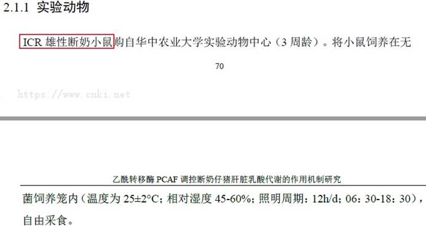

 *图 2-1-18 据其描述使用的 ICR 雄性断奶小鼠（白色）*

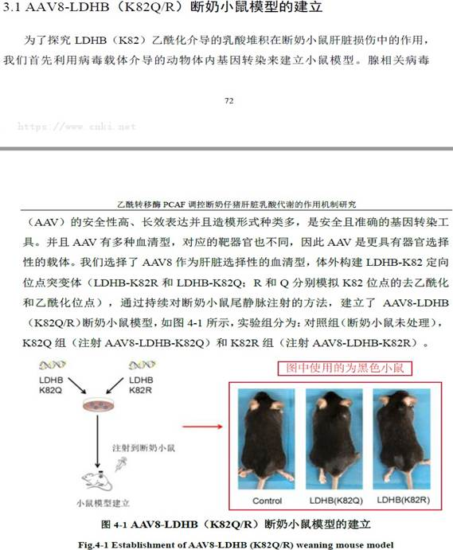

 *图 2-1-19 断奶小鼠模型建立使用的黑色小鼠*

难以想象这样漏洞百出的博士论文是出自一位“学术楷模”，并且顺利通过盲评（三个A）和毕业答辩。

### 2.1.4 Animal Nutrition 发表论文存在的问题

王博士以第一作者于 2017 年 12 月发表 Animal Nutrition 的论文《L-leucine stimulates glutamate dehydrogenase activity and glutamate synthesis by regulating mTORC1/SIRT4 pathway in pig liver》（这部分中简称 Paper 3）存在图像重复使用的问题。Paper 3 中 Fig. 3 C（见 P 335）与 Fig. 4 C（见 P 336）完全相同，在该文章里面仅修改了两个单词就再次使用了同一张 WB 图（图 2-1-20）。

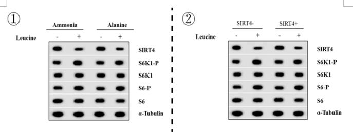

 *图 2-1-20 图①为以氯化铵或丙氨酸作为灌注肝脏的氮源为两组，加入亮氨酸诱导后的 WB 结果。图②为在 SIRT4 缺陷肝细胞和 SIRT4 正常肝细胞中，加入亮氨酸诱导后的 WB 结果。*

### 2.1.5  Meat Science 发表论文存在的问题

把王博士以第一作者身份在《Meat Science》上发表的《The effect of dietary garcinol supplementation on oxidative stability, muscle postmortem glycolysis and meat quality in pigs》与李 J 的硕士论文《山竹醇对肥育猪宰后肌肉糖酵解和肉品质的调控作用及机制研究》进行对比，会发现尽管两者实验处理不一样，但其中部分实验结果完全一致，而部分不一致的实验结果，却又出现显著性或标准差一样的情况。关于这部分详见第三章 3.2 李J 部分，我们将
进行详细展开说明。

### 2.1.6 Journal of Animal Science and Biotechnology 发表论文存在的问题

王博士为第一作者于 2020 年 3 月在《J Anim Sci Biotechnol》发表的《Dietary garcinol supplementation improves diarrhea and intestinal barrier function associated with its modulation of gut microbiota in weaned piglets》与 2021 届徐 MM 硕士学位论文同样存在尽管实验处理不同，但众多结果重复使用、部分结果篡改等现象。关于这部分详见第三章 3.3 徐 MM 部分，我们将进行详细展开说明。
王博士、姚博士为共同第一作者于 2022 年 12 月在《J Anim Sci Biotechnol》发表的《 Embelin alleviates weaned piglets intestinal inflammation and barrier dysfunction via PCAF/NF-κB signaling pathway in intestinal epithelial cells》与 2022 届硕士毕业生温 S 硕士学位论文进行比较后我们发现，尽管研究的猪群和饲喂时间不同，但是两篇论文却多处重复使用相同的结果。关于这部分详见第三章 3.4 温 S 部分，我们将进行详细展开说明。

### 2.1.7 Animal Feed Science and Technology 发表论文存在的问题

将王博士以第一作者身份在《Animal Feed Science and Technology》上发表的《Effect of conditioning temperature on pelleting characteristics, nutrient digestibility and gut microbiota of sorghum- based diets for growing pigs》与黄教授指导的 2017 届毕业生刘 S 的硕士论文《调质温度对猪高粱型日粮加工特性和养分消化率的影响》进行对比，也存在异常的雷同。关于这部分详见第三章 [3.5 刘S ](#_bookmark0)部分，我们将进行详细展开说明。

### 2.1.8  Animal Health and Well Being 和 Journal of Animal Science 论文

将王博士以第一作者身份在《Journal of Animal Science》上发表的《Effects of different processing techniques of palm kernel cake on processing quality of pellet feed, nutrient digestibility, and intestinal microbiota of pigs》与黄教授指导的 2023 届硕士毕业生郭 BY 的硕士论文对比发现，两篇论文多处重复使用了相同的结果，其中部分结果被改动。关于这部分详见第三章[3.6 郭 BY ](#_bookmark1)部分，我们将进行详细展开说明。

### 2.1.9  Frontiers in Microbiology 发表论文存在的问题

将王博士以第一作者身份在《Frontiers in Microbiology》上发表的《The Variation of Nasal Microbiota Caused by Low Levels of Gaseous Ammonia Exposure in Growing Pigs》，与黄教授2018 届毕业生李 J 的硕士论文《不同浓度氨气对生长猪鼻腔微生物区系和呼吸道粘膜屏障的影响》进行对比，尽管两者实验所用动物有一定区别，但实验结果重复使用。关于这部分详见第三章 [3.7 李 J ](#_bookmark2)部分，我们将进行详细展开说明。

### 2.1.10 Journal of Animal Science 发表论文存在的问题

将王博士以第一作者身份于 2019 年在《Journal of Animal Science》发表的《Dietary supplementation with garcinol during late gestation and lactation facilitates acid–base balance and improves the performance of sows and newborn piglets》和黄教授 2021 届硕士毕业生夏 J 的学位论文《妊♘后期日粮添加山竹醇对母猪繁殖性能的作用效果研究》进行比较，发现存在数据异常雷同及篡改等问题。关于这部分详见第三章 [3.8 夏 J](#_bookmark3) 部分，我们将进行详细展开说
明。

### 2.1.11 Journal of Animal Science 论文

在王博士以共同第一作者（排名靠前）的身份发表在《Journal of Animal Science》的文章 《 Dietary supplementation with garcinol during late gestation alleviates disorders of bile acid metabolism and improves the performance of sows and newborn piglets》，不仅存在编造数据等情况，甚至还存在操纵同行评审的情况，使得这篇编造的文章得以顺利发表。关于这部分详见第四章 [4.1 操纵同行评审](#_bookmark4)部分，我们将进行详细展开说明。

### 2.1.12  Animal Health and Well Being 和 Journal of Animal Science 论文的“小问题”

在研读王博士以第一作者身份发表的论文时，还发现了一个有趣的“小问题”。王博士
2023 年在《Animal Health and Well Being》上发表的《Dietary embelin supplementation during mid-to-late gestation improves performance and maternal–fetal glucose metabolism of pigs》（这部分简称 Paper 4），和 2019 年在 《Journal of Animal Science》上发表的《Dietary supplementation with garcinol during late gestation and lactation facilitates acid–base balance and improves the performance of sows and newborn piglets》（这部分简称 Paper 5），大概是因为作者都是王博士，因此，对于材料、方法和结果的描述基本像是复制粘贴的，关键是出现结果也基本一致。
首先，可以看看材料与方法部分。图①为 Paper 5 IgA，IgG 和抗氧化酶测定（见 P 4559），图②为 Paper 4 IgA，IgG 和酶的测定（见P 3）。通过对比，可以发现两者仅数字的表示方法（Paper 5 用阿拉伯数字，Paper 4 用英文）和测定的酶（Paper 4 多测定了 LDHA/B）不同， 其他完全一致。两篇文章的材料与方法除了这部分内容相同外，其他内容也基本一致，感兴趣的可以自行找文章比对。当然，材料与方法相同也没什么问题，但是描述如此一致，怎么通过的查重？

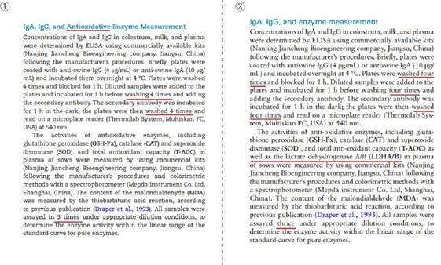

 *图 2-1-21 图①为 IgA，IgG 和抗氧化酶测定，图②为 IgA，IgG 和酶的测定*

再来看看王博士对结果的描述。图①为 Paper 5 对饲粮中添加山竹醇对妊♘后期和哺乳期母猪血液学参数和氧化稳定性的影响的描述（见 P 4560），图②为 Paper 4 对饲粮中添加恩倍酸对妊♘中后期母猪血液学参数和氧化稳定性的影响的描述（见 P 4）。除了饲粮中添加的物质和母猪的阶段不同外，其他的可以说是完全一样，甚至是山竹醇和恩贝酸对母猪的作用效果也是一致的。此外，Paper 4 的描述中，还有些令人不解的地方（红色框标记的地方），比如 “110 of lactation”，但根据结果来看，应该是 “110 of gestation”；还有 “late gestation and lactation”，根据内容推测，应该是“mid-to-late gestation”。Paper 4 出现的错误描述倒是与 Paper 5 的描述相符，实在是令人费解。两篇文章的结果描述，除了此处高度相似外，其他部分的结果描述也异常相似，这就是“心中无查重，我抄我自己”？

 *图 2-1-22 图①为饲粮中添加山竹醇对妊♘后期和哺乳期母猪血液学参数和氧化稳定性的影响，图②为饲粮中添加恩贝酸对妊♘中后期母猪血液学参数和氧化稳定性的影响*
