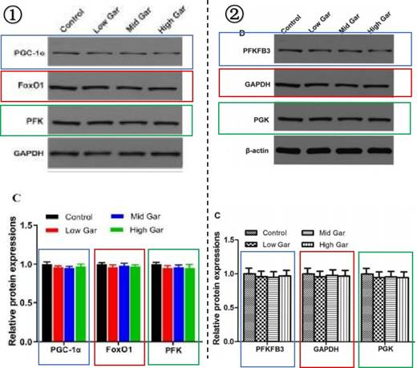
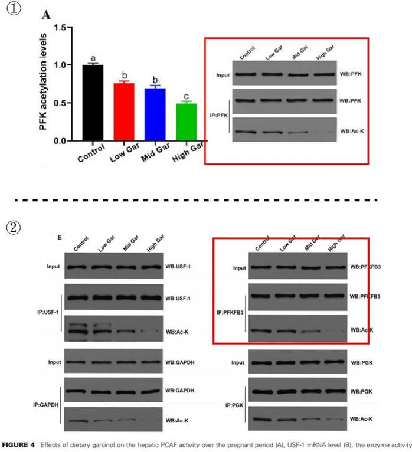
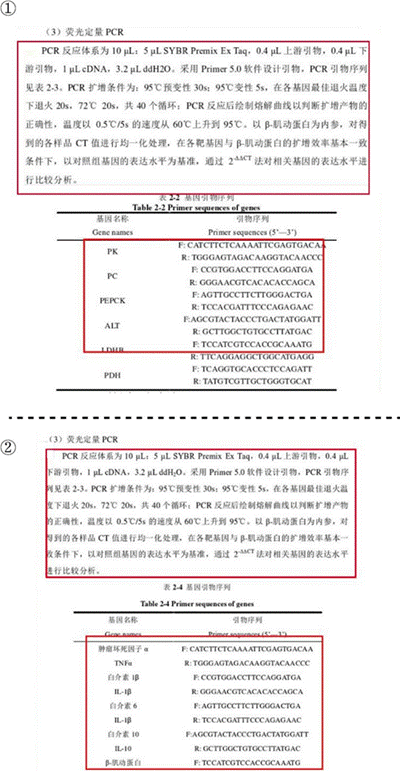
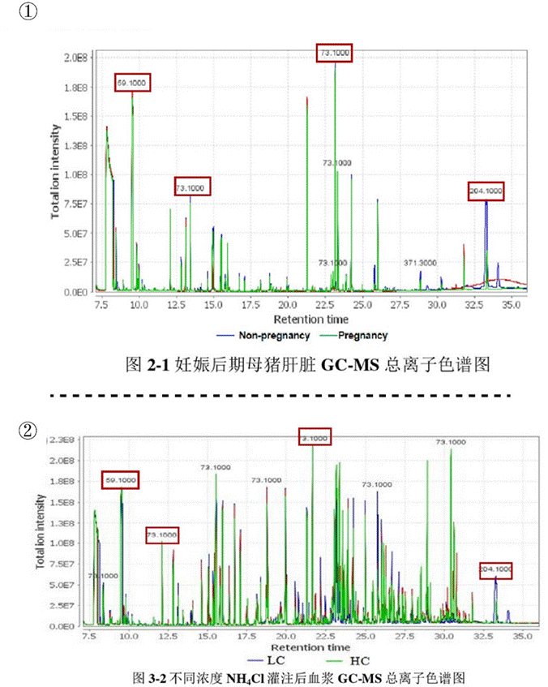
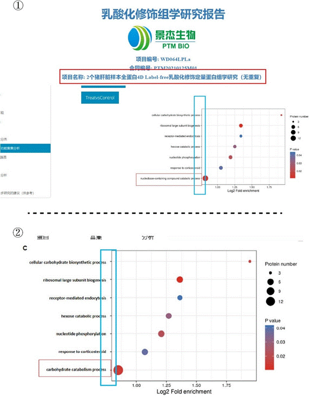

## 2.2   姚某磊博士

> [山竹醇调控妊娠后期母猪肝脏丙酮酸代谢的作用机制研究 - 中国知网 (cnki.net)](https://kns.cnki.net/kcms2/article/abstract?v=0qMDjMp0v1nfLkGAUW9C4d1UIq2WbZJD4j4UZ4maOydGM6MNKfoJuXMTXyfoPATsb7kDJSKlplLtc-aK-n6zUZlXb_w-QO_tZeF3Z5DCuKAynOwYDlbUfuhp36jQbrTxPv90v0GJNkUHMoVmO8MBFw==&uniplatform=NZKPT&language=CHS)

姚博士的学位论文题为《 山竹醇调控妊♘后期母猪肝脏丙酮酸代谢的作用机制研究》（本节中简称学位论文）。姚博士存在的问题和王博士类似，因此这里不做过多赘述以免耽误大家时间，这部分我们将选取一些有代表性的进行说明。

### 2.2.1  学位论文和 The Journal of Nutrition 论文

将姚博士的学位论文和其以第一作者身份在《The Journal of Nutrition》期刊上发表的
《 Dietary Garcinol Attenuates Hepatic Pyruvate and Triglyceride Accumulation by Inhibiting P300/CBP-Associated Factor in Mid-to-Late Pregnant Rats》（在本节中简称 Paper 6）进行对比。在姚博士的学位论文第四章 3.5 小节的图 4-4 C（见 P 70）中，展示了山竹醇对妊♘大鼠肝脏糖异生转录因子及 PFK 表达的影响。而在 Paper 6 的 Fig. 3 的 C、D 图（见 P 235）中，展示了山竹醇对大鼠糖酵解关键蛋白 PGK、PFKFB3 和 GAPDH 表达的影响。对比两张 WB 图后发现，学位论文中描述 PGC-1α、FoxO1 和 PFK 表达结果的 WB 图，与 Paper 6 中山竹醇对大鼠糖酵解关键蛋白 PFKFB3、PGK 和 GAPDH 表达结果的 WB 图完全一致（见图 2-2- 1）。两篇文章的柱状图同样高度相似，仅柱状图样式不同。

 *图 2-2-1 图①为姚博士学位论文图 4-4 C 山竹醇对妊♘大鼠肝脏糖代谢关键蛋白 PGC-*

1α、FoxO1 和 PFK 的影响，图②为 Paper 6 Fig. 3 的图 C、D 部分，展示了山竹醇对大鼠糖酵解关键蛋白 PFKFB3、GAPDH 和 PGK 的影响。

 *图 2-2-2 图①为姚博士学位论文图 4-6 山竹醇对妊♘大鼠肝脏糖酵解的影响中的 A 图，红色方框标记部分为山竹醇对 PFK（磷酸果糖激酶）乙酰化水平的结果。图②为 Paper 6 Fig. 4 图E，红色方框标记部分为山竹醇对 PFKFB3（6-磷酸果糖-2-激酶/果糖-2,6-二磷酸酶 3）乙酰化水平的结果。*

同样，在其学位论文第四章 3.7 小节的图 4-6 A （见 P 72），展示了山竹醇对 PFK（  磷酸果糖激酶）乙酰化水平的结果，Paper 6 的Fig. 4 的E 图（见 P 236），展示了饲粮山竹醇对 PFKFB3（6-磷酸果糖-2-激酶/果糖-2,6-二磷酸酶 3）乙酰化的影响，不同的蛋白却重复使用了同一张 WB 图（见图 2-2-2）。

### 2.2.2  学位论文和他人学位论文

此外，我们还发现在其学位论文第二章的材料方法中，表 2-2 展示了荧光定量 PCR 的基因引物序列（见P 29），而在王博士的学位论文《乙酰转移酶 PCAF 调控断奶仔猪肝脏乳酸代谢的作用机制研究》中，2.4.2 的表 2-4 展示了荧光定量 PCR 的基因引物序列（见 P 30）。
将两张图中基因引物序列进行对比后可以发现，二者学位论文中的不同基因竟然使用的是完全相同的引物序列（见图 2-2-3）。

 *图 2-2-3 图①为姚博士学位论文荧光定量 PCR 和基因引物序列，图②为王博士 2021 年博士毕业论文《乙酰转移酶 PCAF 调控断奶仔猪肝脏乳酸代谢的作用机制研究》荧光定量 PCR 和基因引物序列。*

在其学位论文第二章 3.1 节的图 2-1（见 P 34）中，展示了妊♘后期母猪肝脏样品的 GC- MS 总离子色谱图，在黄教授 2016 届硕士毕业生包 ZX 学位论文《门静脉血氨对仔猪肝脏氨基酸代谢的影响》第三章 3.1 节的图 3-2（见 P 37）中，展示了不同浓度 NH4Cl 灌注后血浆的 GC-MS 总离子色谱图（见图 2-2-4）。将二者进行比对，我们发现，其色谱结果中存在多处数据雷同，色谱图疑似进行过删改。

 *图 2-2-4 图①为姚博士学位论文母猪肝脏样品的 GC-MS 总离子色谱图，图②为包 ZX 2016 年硕士毕业论文《门静脉血氨对仔猪肝脏氨基酸代谢的影响》。*

在其学位论文第二章 3.5.1 节的图 2-5 C（见P 39），展示了妊♘后期母猪肝脏上调乙酰化蛋白质参与的生物学通路。与原始数据进行对比我们发现，姚博士仅仅检测了 2 个猪肝脏样本全蛋白，这不符合检测样本的可重复性。此外，研究报告显示检测结果是蛋白的乳酸化修饰，与其研究内容蛋白的乙酰化修饰毫无关系，但姚博士仍将结果用到了自己的学位论文中，还将原始图片纵坐标的最后一个生物学通路进行了篡改（从蓝框可以看出明显的篡改痕迹，字体间距和纵坐标间距对不上），从而变成自己想要的实验结果（见图 2-2-5)。

 *图 2-2-5 图①为姚博士的学位论文的原始数据，图②为姚博士学位论文妊♘后期母猪肝脏上调乙酰化蛋白质参与的生物学通路。*

此外，在对比姚博士的学位论文与黄教授 2020 届硕士毕业生贺 QY 的学位论文后我们发现，尽管两篇论文的试验是完全不同的，但是却存在部分 WB 图完全相同（重复使用）的现象。关于这部分详见第三章 3.11 贺 QY 部分，我们将进行详细展开说明。