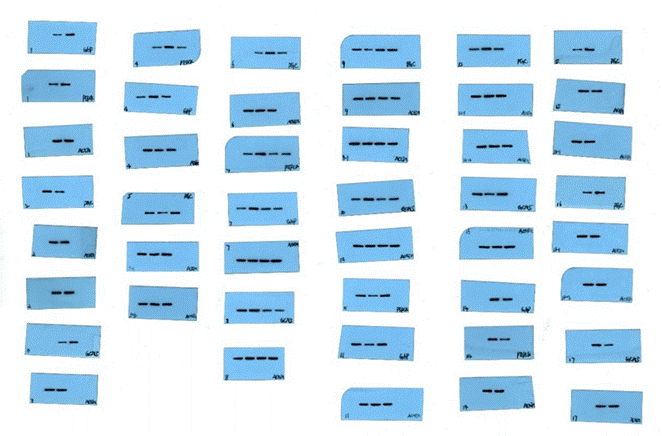

## 2.3   秦某山博士

> [肠道菌群代谢物丁酸对妊娠后期母猪肝脏糖异生的作用机制研究 - 中国知网 (cnki.net)](https://kns.cnki.net/kcms2/article/abstract?v=0qMDjMp0v1nfLkGAUW9C4d1UIq2WbZJD4j4UZ4maOydGM6MNKfoJuVGX2LoFb8ffCfvFDnRZZsiM1ttjpH5_uAU5py80ENtpAQp7soVeflsw_wRbAYB4XAfDdJSHyeoXcABW7j7nmFpH7RCvMZ8gLg==&uniplatform=NZKPT&language=CHS)

秦博士是黄教授指导的 2023 届博士毕业生，其学位论文题为《肠道菌群代谢物丁酸对妊♘后期母猪肝脏糖异生的作用机制研究》（本节中简称学位论文）。首先我们来看看其 WB 结果的所谓“原始图片”，正如我们在前言中所说的那样，在这里想要什么样的 WB 结果，都有公司为你“量身定制”出完美的结果。因此这些“原始图片”风格一致，连起码的 Marker 都没有（图 2-3-1）。

 *图 2-3-1 公司检测 WB 结果原始数据除此之外，我们在此基础上还发现，其学位论文存在是 WB 条带混用、乱用的情况。具体来说，我们分别在论文的图 4-5 E（见 P 58）、图 4-6 E（见P 59）、图 4-7 E（见 P 60)、图 4-8 C（见 P 61）中发现了这样的问题，在论文中被描述为 PGC-1α 的结果在检测结果中被标记为ACTIN（图 2-3-2、图 2-3-3、图 2-3-4 及图 2-3-5）。*

 *图 2-3-2 图①为学位论文图 4-5 E；图②为检测结果原图*

 *图 2-3-3 图①为学位论文图 4-6 E；图②为检测结果原图*

 *图 2-3-4 图①为学位论文图 4-7 E；图②为检测结果原图*

 *图 2-3-5 图①为学位论文图 4-8 C；图②为检测结果原图*

除此之外，秦博士在数据上的“筛选”、“加工”也“大刀阔斧”。在学位论文和其对应发表的学术论文《Targeting gut microbiota-derived butyrate improves hepatic gluconeogenesis through the cAMP-PKA-GCN5 pathway in late pregnant sows》（本部分中简称 Paper 7）中，我们发现多处应展示相同结果的图表上对应的数值却存在不同之处，接下来将进行展开说明。
首先，在 1-酮糖对妊♘后期母猪繁殖性能的影响这部分结果中我们可以看到，学位论文中样本量 n=40，而 Paper 7 中样本量 n=20。但在样本量截然不同的情况下，其结果中的大部分数据却保持一致。有趣的是，秦博士又修改了每头仔猪平均出生活重和出生每头仔猪窝重的平均值，而 P 值则保持不变（图 2-3-6）。

 *图 2-3-6  图①为学位论文表 5-3（见 P 68）；图②为 Paper 7 Table 5（见 P 4370*

在处理、分组完全一致的情况下，G6P 和 PEPCK 结果也存在部分相同部分不同的情况完全不同（图 2-3-7）。

 *图 2-3-7 图①为学位论文图 4-7（见 P 60）；图②为 Paper 7 Fig. 7（见 P 4369）*

在展示完全相同的结果的图中，Paper 7 的柱形图数值又明显高于学业论文的柱形图结果（图 2-3-8）。

 *图 2-3-8 图①为学位论文图 4-8（见 P 61）；图②截取自 Paper 7 Fig. 7（见 P 4369）*

根据纵坐标可以看出，由红线标注的 PKA 的活性在①中明显高于②中的活性，除此之外，其他结果均相同（图 2-3-9）。

 *图 2-3-9 图①为学位论文图 4-5（见 P 58）；图②截取自 Paper 7 Fig. 5（见 P 4367）*

在展示血糖偏低对妊♘后期母猪繁殖性能的影响的三线表中，出生（活仔）每头仔猪窝重的血糖偏低组数据被修改，其他结果均相同（图 2-3-10）。

 *图 2-3-10 图①为学位论文表 2-2（见 P 22）；图②截取自 Paper 7 Table 1（见 P 4364）*

在展示血糖偏低对妊♘后期母猪肝门静脉和肝脏短链脂肪酸的影响的三线表中，肝门静脉血中乙酸浓度的 P 值被修改，其他结果均相同（图 2-3-11)。

 *图 2-3-11 图①为学位论文表 3-5（见 P 43）；图②截取自 Paper 7 Table 4（见 P 4365） 除了数据篡改之外，秦博士在 16S 检测结果部分还涉及到了数据编造的问题。通过观察*

送样检测的结果，我们发现每个分组中秦博士只送检了三个样品，然而在学位论文的表注中却标明“n=10”，即样本量为 10，难道“以小见大”的道理在科研中也适用？再看 Alpha 多样性部分的结果，可以看到其使用了部分检测数据，至于正常组的数据怎么来的，自然是不言而喻了（图 2-3-12）。

 *图 2-3-12 图①为秦博士送往公司检测的检测报告；图②为根据检测报告原数据整理后的三线表；图③为秦博士学位论文表 2-4（见 P 25）展示的结果*

在学位论文的图 2-6 中展示了 PCoA 和NMDS 结果（见P 28），我们可以直观地看出秦博士数据编造的“技巧”。尽管每个分组只有三个样品进行检测，但通过编造数据，他成功地呈现了一个包含十个数据点的结果。通过对比检测报告和学位论文中的结果，我们可以发现原始数据点在学位论文中仍然一一对应，并且横纵坐标与检测报告原图完全相同，只是各自多出了几个编造的数据点（图 2-3-13 及图 2-3-14）。

 *图 2-3-13 图①为秦博士送往公司检测的检测报告；图②为秦博士学位论文图 2-6 基于 Bray- Curtis 距离的 Beta 多样性分析的主坐标分析，86 个属在妊♘后期母猪中差异富集情况见（P 28）展示的结果*

 *图 2-3-14 图①为秦博士送往公司检测的检测报告；图②为秦博士学位论文图 2-6 基于 Bray- Curtis 距离的 Beta 多样性分析的主坐标分析，86 个属在妊♘后期母猪中差异富集情况（见 P 28）展示的结果*

此外，我们还发现了一点“小乐子”。在秦博士的学位论文中，他多次使用“SB”来代表实验处理方法（实际上应为NaB）。这也许是秦博士不甘的呐喊吧，他在暗讽那些造假的人都是“SB”，或者他觉得整个虚假的研究课题和实验本身就是“SB”一样的笑话？当然，这些我们就不得而知了（图 2-3-15）。

 *图 2-3-15 图①和图②为秦博士学位论文中用“SB”进行实验处理*

对于以上三位博士的诸多结果，无需多言就能让大家一目了然，毫不掩饰地肆意造假、改动，但凡有多看他们两眼文章的人都能看出问题。虽然我们深知他们有多不堪，但在整理这些材料的过程中还是深感震惊。难以想象在 211 高校的双一流学科，会有如此胆大包天的教授带领一些深谙其道的学生，把学术道德狠狠践踏在脚下。