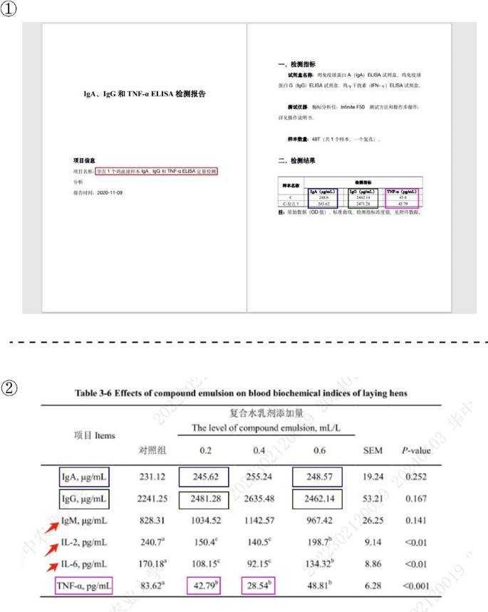
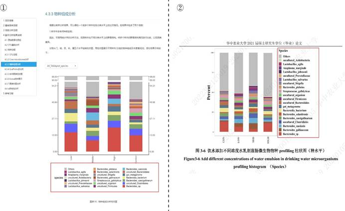

## 3.1   张 Z

张 Z 是黄教授指导的 2021 级硕士毕业生，其毕业论文题目为《复合水乳剂对蛋鸡蛋品质、肠道健康和微生物区系的改善作用研究》。然而，在对比其学位论文与原始数据后，发现存在严重的数据篡改、编造等现象。
首先展示的是其血液生化指标结果，检测报告显示，该实验仅检测了 1 个鸡血液样本中的 IgA、IgG 和 TNF-α （图 3-1-1 中①）。但在仅有一个样本的情况下，这部分数据仍然被利用到了极致。在其学位论文表 3-6（见 P 38）水乳剂对蛋鸡血液生化指标的影响结果中，仅部分数据能和少得可怜的原始数据对上，还有部分数据“物尽其用”进行了改动（比如原始数据中 IgG 的 2471.28 被改成了学位论文中的 2481.28，而 TNF-α 结果的 45.8 竟被倒过来成了 28.54）（图 3-1-1 中②）。在开发完了这些数据后，其余指标的数据均为其编造而来。

 *图 3-1-1 图①为 ELISA 检测报告，图②为其学位论文水乳剂对蛋鸡血液生化指标的影响*

而在 16S rDNA 测序微生物多样性的结果方面，其检测的样本个数仅为四个（即每组仅一个）（图 3-1-2），这明显不符合科学实验的基本要求（一组至少三个生物学重复）。不仅如此，张 Z 还对检测数据进行了大量的改动和编造。

 *图 3-1-2 张 Z 学位论文实验的 16s rDNA 区段测序微生物多样性结题报告*

将报告中的 α 多样性指数与其学位论文中表 3-8 （见 P 41） “水乳剂对蛋鸡肠道细菌 α 多样性的影响”进行对比，能够发现其 “故技重施”：用一点 （如 936.93 和 1007.55 等），改一点 （1071.51 改为 1371.51，1088.19 改为 1388.19，1024.08 改为 1424.08），造一点 （Shannon和 Simpson 指数）（图 3-1-3)。

 *图 3-1-3 图①为报告中的 α 多样性指数，图②为其学位论文中水乳剂对蛋鸡肠道细菌 α 多样性的影响。*

此外，将检测报告中的物种组成分析分别与其学位论文中的表 3-4 a （见 P 42） “饮水添加不同浓度水乳剂盲肠微生物物种 profiling 柱状图（门水平）”和表 3-6（见P 44）“饮水添加不同浓度水乳剂盲肠微生物物种 profiling 柱状图（种水平）”对比发现，除了菌群种类大体一致，各种菌群的丰度进行了大量篡改（图 3-1-4 和图 3-1-5）。

 *图 3-1-4 图①为报告中的门水平的物种组成分析，图②为其学位论文中饮水添加不同浓度水乳剂盲肠微生物物种 profiling 柱状图（门水平）。*

 *图 3-1-5 图①为报告中的种水平的物种组成分析，图②为其学位论文中饮水添加不同浓度水乳剂盲肠微生物物种 profiling 柱状图（种水平）。*

将报告中的 PCA 分析和 NMDS 分析结果与其学位论文中图 3-3（见 P 40）“基于 OTU丰度的 NMDS 分析和 PCA 分析”对比进行对比，能依稀看到原图的部分痕迹，其余的点均为“凭空产生”（图 3-1-6 及图 3-1-7）。

 *图 3-1-6 PCA 分析结果报告。*

图①为报告中 PCA 分析，图②为其学位论文中基于 OTU 丰度的 PCA 分析

 *图 3-1-7 NMDS 分析结果报告。*

图①为报告中 PCA 分析，图②为其学位论文中基于 OTU 丰度的 NMDS 分析。

#### 3.1.1   硕士“失火”，殃及“本科生”

在此基础上演变出的事情更加离谱，就是这样一份肆意篡改的假数据，也被充分利用， 不仅供张 Z 硕士毕业，此外还有两位本科生也共同使用了这份数据，分别是于某弘的本科毕业论文以及彭某阳的本科毕业论文，可谓是“物尽其用”了。
在黄教授所指导于某弘（2021 届本科毕业生）、彭某阳（2021 届本科毕业生）、张 Z（2021 届硕士毕业生）三人的学位论文题目分别为《百里香酚-甲酸复合乳剂对蛋鸡生产性能和肠道功能的影响》、《百里香酚和肉桂醛对鸡蛋品质及肠道功能的影响》、《复合水乳剂对蛋鸡蛋品质、肠道健康和微生物区系的改善作用研究》（本节中分别简称学位论文 1、学位论文 2、学位论文 3）。尽管三人的研究内容各不相同，但他们的实验结果中的却高度一致。
首先我们对三者论文中蛋鸡血液生化指标结果进行比较（图 3-1-8）。学位论文 1 表 5 （见 P 12）展示了复合乳剂对蛋鸡血液生化指标的影响、学位论文 2 表 3-3（见 P 11）展示了饲粮预混料对蛋鸡血液生化指标的影响、学位论文 3 表 3-6（见 P 38）水乳剂对蛋鸡血液生化指标的影响，尽管三人的实验所饲喂蛋鸡的物质不同，但三人的结果数据却完全一致。

 *图 3-1-8 图①为学位论文 1 中复合乳剂对蛋鸡血液生化指标的影响，图②为学位论文 2 中饲粮*

预混料对蛋鸡血液生化指标的影响，图③为学位论文 3 中水乳剂对蛋鸡血液生化指标的影响。
再对三者论文中蛋鸡蛋品质结果进行比较（图 3-1-9）。学位论文 2 表 3-2（见P 10）展示了饲粮预混料对鸡蛋品质的影响，学位论文 3 表 3-5（见P 37）展示了水乳剂对鸡蛋品质的影响，这两部分内容完全一致。有趣的是，学位论文 1 表 4（见 P 11）展示了复合乳剂对鸡蛋品质的影响的数据结果虽然仍与学位论文 2、学位论文 3 中的数据一致，但其在“蛋黄颜色”一栏数据中，每个数据进行了“加一”处理（蓝色框标出），不知有何深意。

 *图 3-1-9 图①为学位论文 1 中复合乳剂对鸡蛋品质的影响，图②为学位论文 2 中饲粮预混料对*

鸡蛋品质的影响，图③为学位论文 3 中水乳剂对鸡蛋品质的影响。
再对蛋鸡生产性能的影响结果进行比较。学位论文 1 表 3（见 P 10）展示了复合乳剂对蛋鸡生产性能的影响，学位论文 3 表 3-4（见 P 37）展示了水乳剂对蛋鸡生产性能的影响， 二者对比发现，图中红色框中标出的数据完全一致（图 3-1-10）。

 *图 3-1-10 图①为学位论文 1 中复合乳剂对蛋鸡生产性能的影响，图②为学位论文 3 中水乳剂对蛋鸡生产性能的影响。*

学位论文 1 中表 6（见 P 12，P 13）展示了复合乳剂对蛋鸡肠道形态的影响，学位论文3 中表 3-7（见 P 39）展示了水乳剂对蛋鸡肠道形态的影响，对比这两部分数据我们发现， 两部分数据结果完全一致（图 3-1-11)。

 *图 3-1-11 图①为学位论文 1 中复合乳剂对蛋鸡肠道形态的影响，图②为学位论文 3 中水乳剂对蛋鸡肠道形态的影响。*

学位论文 1 中图 1（  见P 13）展示了复合乳剂对空肠和回肠肠道形态的影响，学位论文 3 中图 3-1 展示了复合乳剂（复合水乳剂）对空、回肠组织病理学的影响，二者对比发现， 此部分二者所呈现的图片完全一致（图 3-1-12）。

 *图 3-1-12 图①为学位论文 1 中复合乳剂对空肠和回肠肠道形态的影响，图②为学位论文 3 中复合乳剂（复合水乳剂）对空、回肠组织病理学的影响。*

学位论文 1 中图 2（  见P 14）展示了复合乳剂对肠黏膜紧密连接的影响，学位论文 3 中图 3-2（见 P 40）展示了复合水乳剂对肠黏膜紧密连接的影响，两部分对比发现，二者图片内容再次完全一致（图 3-1-13）。

 *图 3-1-13 图①为学位论文 1 中复合乳剂对肠黏膜紧密连接的影响，图②为学位论文 3 中复合水乳剂对肠黏膜紧密连接的影响。*

学位论文 1 中图 3（见 P 15）中图 B 展示了属分类级别的相对丰度柱状图，图 C 展示了种分类级别的相对丰度柱状图，学位论文 3 中图 3-5（见P 43）展示了饮水添加不同浓度水乳剂盲肠微生物物种 profiling 柱状图（属水平），图 3-6（见 P 44）展示了饮水添加不同浓度水乳剂盲肠微生物物种 profiling 柱状图（种水平）。两篇文章此部分对比我们发现，学位论文 1 中图 B 与学位论文 3 中图 3-5 图片内容完全一致，学位论文 1 中图 C 与学位论文 3 中图 3-6 图片内容完全一致（图 3-1-14）。

 *图 3-1-14 图①为学位论文 1 中属分类级别的相对丰度柱状图（图 B）与种分类级别的相对丰度柱状图（图 C），图②为学位论文 3 中饮水添加不同浓度水乳剂盲肠微生物物种 profiling 柱状图（属水平），图③为学位论文 3 中饮水添加不同浓度水乳剂盲肠微生物物种 profiling 柱状图（种水平）。*
