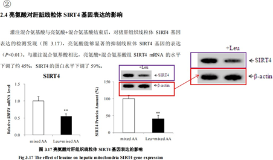
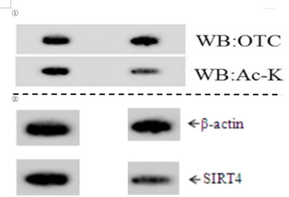

## 3.10   李 LL

> Pillar-of-Academic-Shame：[亮氨酸调控猪肝脏氨代谢的作用机制研究 - 中国知网 (cnki.net)](https://kns.cnki.net/kcms2/article/abstract?v=0qMDjMp0v1nYQNbgB5M_KrwFFRilHYDjtM38iHVsDQFuadD_fRKN8dGUcj93CV4EWu5ABu4pJcxhvOa0co1gkpkxbAQuzYiDPiUinXwkIUwzI_JzrlHA3C7KEv4xKnGZVqyNCAM-D0KR7b9NHtqw1w==&uniplatform=NZKPT&language=CHS)

黄教授指导的 2016 届硕士毕业生李 LL，其学位论文题为《亮氨酸调控猪肝脏氨代谢的作用机制研究》（在这一节简称学位论文）与其作为第一作者于 2016 年 4 月在期刊《Scientific Reports》发表的《PGC-1α Promotes Ureagenesis in Mouse Periportal Hepatocytes through SIRT3 and SIRT5 in Response to Glucagon》（在这一节简称 Paper 14）中的 WB 图存在一图多用的行为。
在 Paper 14 Fig. 1 D（见 P 4）中，该图片表达的是禁食小鼠的 OTC 的活性显著升高， 而在学位论文图 3.17（见 P 51）表达的是亮氨酸能够显著的抑制线粒体 SIRT4 基因的表达
（见图 3-10-1），所用 WB 条带完全相同（但经过了变形处理），我们用相同颜色的方框配对相同的 WB 图。

 *图 3-10-1 图①为 Paper 14 Fig. 1 D，禁食小鼠的 OTC 的活性显著升高，图②为学位论文图*

3.17 表达的是亮氨酸能够显著的抑制线粒体 SIRT4 基因的表达。
下图为经过放大处理后的结果（图 3-10-2)。

 *图 3-10-1 经过放大处理后，①为 Paper 14 Fig. 1 D，图②为学位论文图 3.17。*
