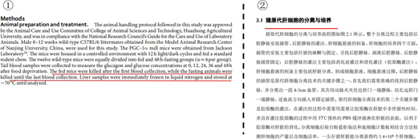
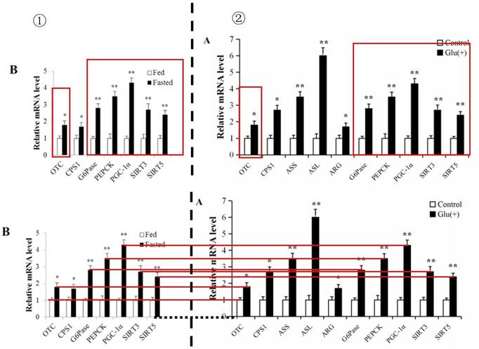

## 3.11  张 P

> Pillar-of-Academic-Shame：[PGC-1α通过SIRT3和SIRT5调控猪肝细胞尿素循环的作用研究 - 中国知网 (cnki.net)](https://kns.cnki.net/kcms2/article/abstract?v=0qMDjMp0v1naSEcKxSwi-WduW-whJj-jPaT9UrH3d4MP3BGQVtC7Ug4bTD46s2T_Tahph4pfFFsAQrEUD_LLWYi2mGVbBs5WhQOuNiRuDOy57JTMIbQFE9J-UxdqYgKaHZj2mTu1b9Fb41RCVAfPoQ==&uniplatform=NZKPT&language=CHS)

黄教授指导的 2017 届硕士毕业生张 P，将其学位论文题为《PGC-1α 通过 SIRT3 和SIRT5调控猪肝细胞尿素循环的作用研究》（在这一节简称学位论文）与 3.10 节提到的李 LL 为第一作者于 2016 年 4 月发表的《PGC-1α Promotes Ureagenesis in Mouse Periportal Hepatocytes through SIRT3 and SIRT5 in Response to Glucagon》（在这一节简称 Paper 14）进行对比。我们发现尽管该 Paper 14 与学位论文的研究对象和内容上存在相似之处，但两者用的分别是小鼠和猪的肝脏细胞。Paper 14 使用的细胞是从小鼠的肝脏样本中获取，学位论文使用的则是猪原代肝细胞（见图 3-11-1）。

 *图 3-11-1 图①为 Paper 14 材料与方法部分（见 P 4），划红线部分描述了使用的细胞是从小鼠的肝脏样本中获取。图②描述了学位论文中猪原代肝细胞的分离与培养（见 P 51）。*

接下来我们来看看两篇文章的相似之处，Paper 14 Fig. 1 A 禁食诱导小鼠肝脏尿素生成和糖异生（见 P 4）相关 mRNA 表达数据与学位论文图 2.2 A 胰高血糖素对仔猪肝细胞糖异生和尿素循环通路上相关基因表达的影响 （见 P 30）存在高度一致。我们将图片等比例放大，置于同一水平比较，注意两篇论文中实验细胞和对照处理完全不同，但 6 个指标（OTC、G6Pase、PEPCK、PGC-1α、SIRT3、SIRT5）相关柱状图几乎完全一致（见图 3-11-2）。

 *图 3-11-2 图①为 Paper 14 Fig. 1 A 相关 mRNA 表达水平，图②为学位论文图 2.2 A 相关mRNA 表达水平。*
