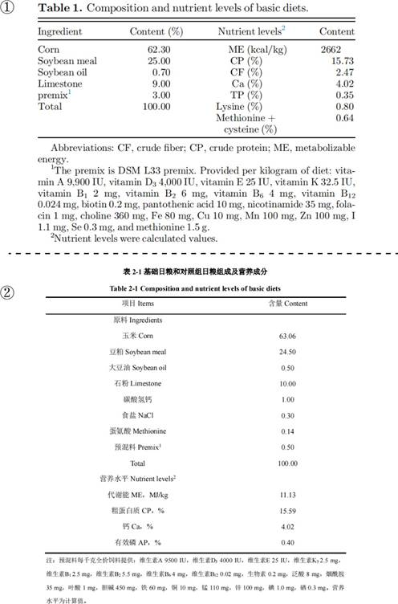
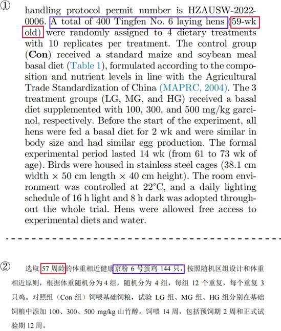
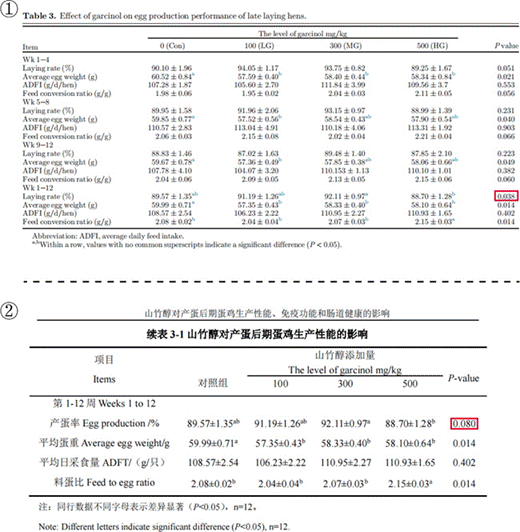
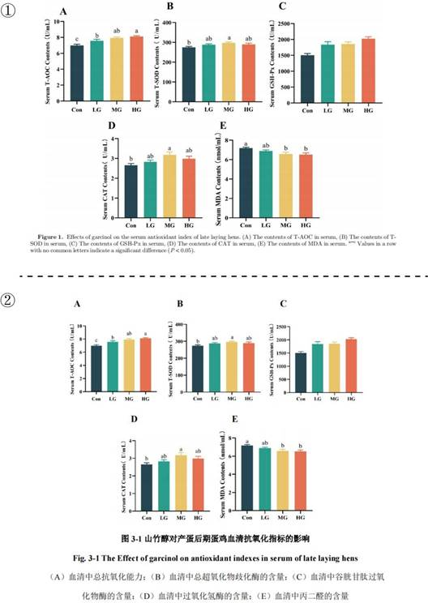
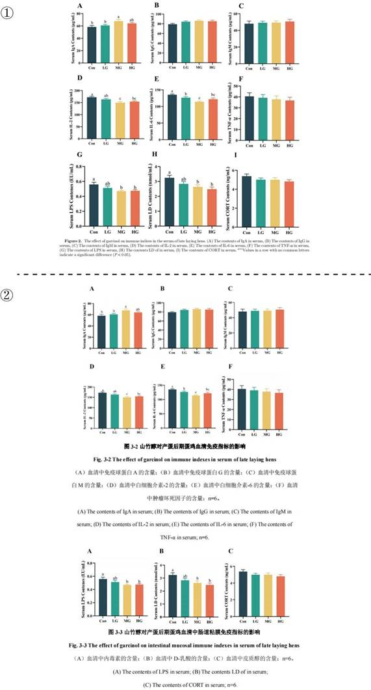
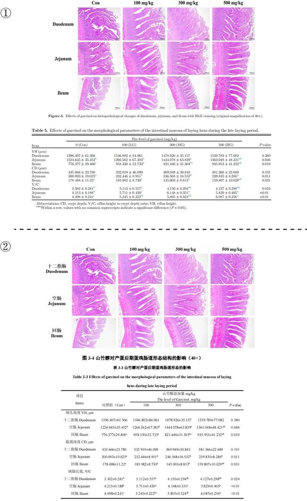
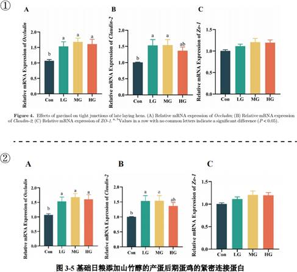
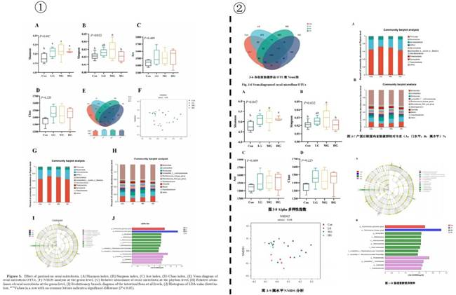

## 3.12   王 Y

> Pillar-of-Academic-Shame：[山竹醇对产蛋后期蛋鸡生产性能、免疫功能和肠道健康的影响 - 中国知网 (cnki.net)](https://kns.cnki.net/kcms2/article/abstract?v=0qMDjMp0v1l_FNboceAUBhdGD7XiRV6PjJh8vYoX8UOoBfDIE5wUGJh680LhfbpCRXJuzijoD5Y8EEXYLUHwx0jaFWi5KuoJD0ok6Rp8v64sASI6FOpSZWFcyX3ReA1G5Ltix2poDeI-TWMAoGw2eQ==&uniplatform=NZKPT&language=CHS)

王Y 是黄教授指导的 2022 届硕士毕业生，其毕业论文为《山竹醇对产蛋后期蛋鸡生产性能、免疫功能和肠道健康的影响》（这部分简称学位论文）与姚博士于 2023 年 7 月在《Poultry Science》上发表的《Effects of garcinol supplementation on the performance, egg quality, and intestinal health of laying hens in the late laying period》（这部分简称 Paper 15）的试验对应。在材料方法、试验结果及所用图片高度一致，且王Y 未列为作者的情况下，还存在篡改结果等学术造假行为。首先，尽管王 Y 完成了下场采样，但仅送检部分样品来检测微生物多样性，其它实验数据大多为凭空编造。但就这样一份虚假的数据，还被姚博士学术剽窃来发表了论文。
我们先对比下两人的试验方法部分，如图 3-12-1，Paper 15 中 Table 1 的日粮配方（P 2）和学位论文的表 2-1 日粮配方（P 14）完全不同。如图 3-12-2，试验设计中 Paper 15（P2）选取的是 59 周龄的京粉 6 号蛋鸡 400 只。而学位论文（P 13）选取的是 57 周龄的京粉6 号蛋鸡 144 只。在这种样本数不同、样本不同、日粮配方不同的情况下，却得出了几百个相同的数据（见后文），真是让人匪夷所思。

 *图 3-12-1 图①为 Paper 15 中日粮的组成和营养水平；图②为学位论文中基础日粮和对照组日粮组成及营养成分*

 *图 3-12-2 图①为 Paper 15 材料方法中的动物试验部分；图②为学位论文材料方法中的试验设计*

如图 3-12-3，我们通过对比可以发现，Paper 15（P 4）中第一个结果 Effects of Dietary Garcinol on Egg Production Performance 部分，就开始和学术论文（P 22-23）的数据一模一样。有意思的是，在 Paper 15 中Table 3 的产蛋性能数据都和学位论文一样的情况下，1-12 周的产蛋率的显著性却不一样了。

 *图 3-12-3 图①为 Paper 15 中产蛋后期蛋鸡生产性能的影响；图②为学位论文中产蛋后期蛋鸡生产性能的影响*

并且这篇 Paper 15 其他的结果都能在学位论文中找到相同数据。如图 3-12-4，Paper 15 的 Fig. 1（P 5）和学位论文的图 3-1（P 25）对比，山竹醇对产蛋后期蛋鸡血清抗氧化指标的影响完全相同；如图 3-12-5，Paper 15 的 Fig. 2（P 6）和学位论文的图 3-2、3-3（P 26、27）对比，山竹醇对产蛋后期蛋鸡血清抗氧化的影响完全相同；如图 3-12-6，Paper 15 的Fig. 3、Table 5（P 7）和学位论文的图 3-4、表 3-3（P 28）对比，山竹醇对产蛋后期蛋鸡肠道形态及结构的影响在图片和数据上一模一样；如图 3-12-7，Paper 15 的 Fig. 4（P 8）和学位论文的图 3-5（P 29）对比，山竹醇对产蛋后期蛋鸡的紧密连接基因表达影响一模一样。

 *图 3-12-4 图①为 Paper 15（P 5）山竹醇对产蛋后期蛋鸡血清抗氧化指标的影响；图②为学位论文（P 25）山竹醇对产蛋后期蛋鸡血清抗氧化指标的影响*

 *图 3-12-5 图①为 Paper 15（P 6）山竹醇对产蛋后期蛋鸡血清免疫指标的影响；图②为学位论文（P 26、27）山竹醇对产蛋后期蛋鸡血清免疫指标的影响*

 *图 3-12-6 图①为 Paper 15（P 7）山竹醇对产蛋后期蛋鸡肠道形态及结构的影响；图②为学位论文（P 28）山竹醇对产蛋后期蛋鸡肠道形态及结构的影响*

 *图 3-12-7 图①为 Paper 15（P 8）山竹醇对产蛋后期蛋鸡的紧密连接基因的影响；图②为学位论文（P 29）山竹醇对产蛋后期蛋鸡的紧密连接基因的影响*

包括 Paper 的 Fig. 5（P 9）山竹醇对产蛋后期蛋鸡肠道菌群结构的影响，都能在学位论文（P 30-34）上找到相同的图片。

 *图 3-12-8 图①为 Paper 15（P 8）山竹醇对产蛋后期蛋鸡肠道菌群结构的影响；图②为学位论文（P 30-34）山竹醇对产蛋后期蛋鸡肠道菌群结构的影响*
