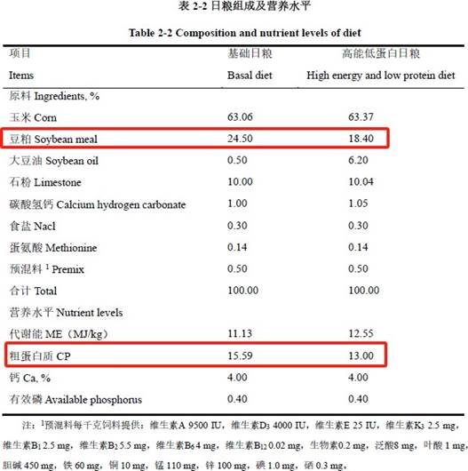

## 3.13   彭 G

> Pillar-of-Academic-Shame：[山竹醇对产蛋后期蛋鸡脂肪肝综合征作用效果的研究 - 中国知网 (cnki.net)](https://kns.cnki.net/kcms2/article/abstract?v=0qMDjMp0v1kaoyxUS37Vfp0iW873Xdp27eWWn-7Cye5HTSUoa1pv16EKM9IdWG47QUEdFB5rWcypOoWdnwL2bFQ9uWPaHsIadNlWOrXez9QTNLKvmre6dbPmdBdiRCA1z7ymnSVEL6X1BVBC72Ls2g==&uniplatform=NZKPT&language=CHS)

彭G 是黄教授指导的 2023 届硕士毕业生，其学位论文题目为《山竹醇对产蛋后期蛋鸡脂肪肝综合征作用效果的研究》（在这一节中简称学位论文）。尽管彭 G 完成了下场采样，但仅切片结果为送检而得，其余实验结果大多为凭空编造。
如图 3-13-1 是其学位论文中试验日粮的饲料配方（见 P 16），从图中我们可以看出，高能低蛋白日粮组相对于基础日粮组，其豆粕组成从 24.5%降低到 18.40%，粗蛋白质营养水平从 15.59%降低到 13.00%。在蛋白质水平降低而不额外补充氨基酸的情况下，高能低蛋白组的蛋鸡产蛋率竟然高于对照组（见图 3-13-2）。因此在其毕业答辩时，其实验结果遭到各位评审专家质疑，彭某上传的学位论文最终版表 2-5 中又对数据进行了篡改（见P 29）（红色方框标记部分）。

 *图 3-13-1 学位论文表 2-2 日粮组成及营养水平*

 *图 3-13-2 图①是拍于毕业答辩当天彭 G 学位论文中山竹醇对 FLHS 蛋鸡生产性能的作用效果。图②是下载于中国知网的彭 G 学位论文中山竹醇对 FLHS 蛋鸡生产性能的作用效果。*

除此之外，如图 3-13-3，可以看到彭 G 学位论文的图 2-8 到 2-13（见 P 32-37），多个柱状图的显著性几乎一模一样，我们用相同颜色方框标记。为什么会有如此一致且完美的数据？凭空编造罢了。

 *图 3-13-3 图①为学位论文图 2-8 山竹醇对 FLHS 蛋鸡肝脂变化的作用效果（见 P 32）。图②为学位论文图 2-9 山竹醇对 FLHS 蛋鸡肝功能的作用效果（见 P 33）。图③为学位论文图 2-10 山竹醇对 FLHS 蛋鸡血清抗氧化功能的影响（见 P 34）。图④为学位论文图 2-11 山竹醇对 FLHS蛋鸡肝脏抗氧化功能的（见 P 35）。图⑤为学位论文图 2-12 山竹醇对 FLHS 蛋鸡血清脂质代谢的影响（见 P 36）。图⑥为学位论文图 2-13 山竹醇对 FLHS 蛋鸡肝脏脂质代谢的影响（见 P 37)*
