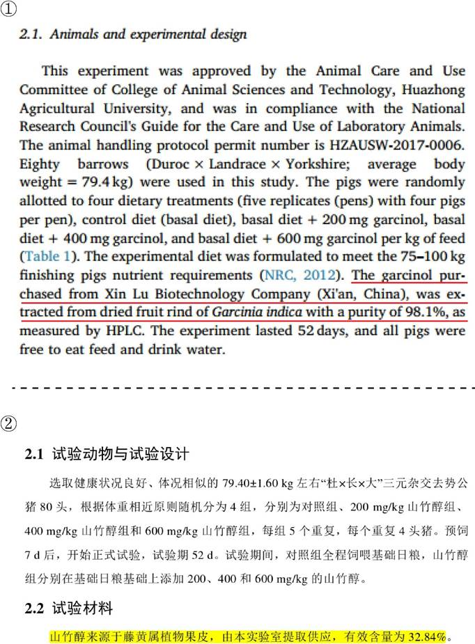
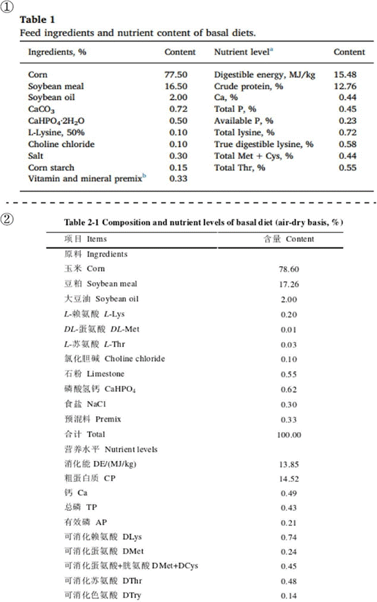
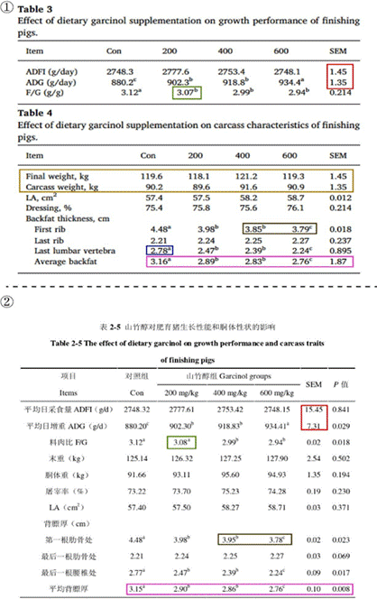
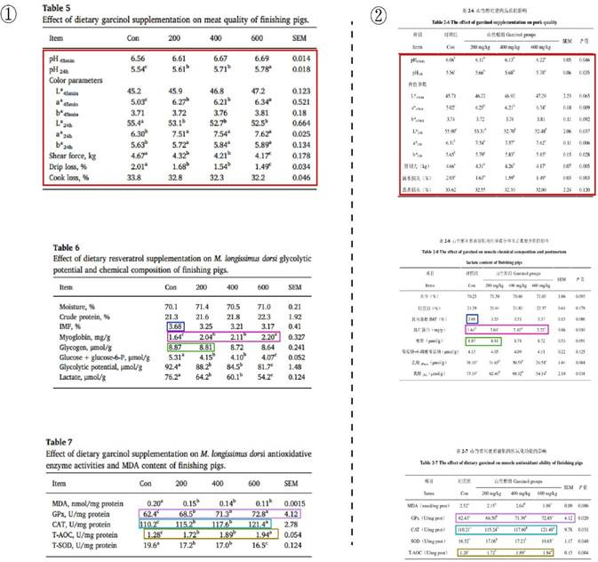
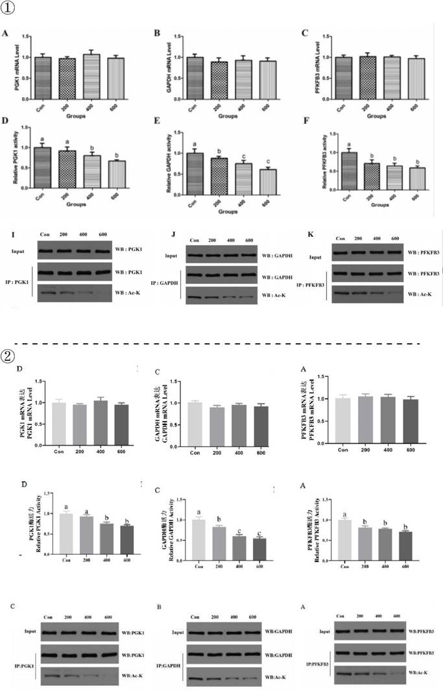
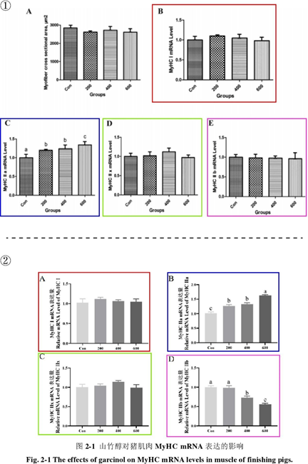

## 3.2   李 J

> Pillar-of-Academic-Shame：[山竹醇对肥育猪宰后肌肉糖酵解和肉品质的调控作用及机制研究 - 中国知网 (cnki.net)](https://kns.cnki.net/kcms2/article/abstract?v=0qMDjMp0v1mALCQYr1xi5bqYvz0V2kv7qgB8ZrHqQ1YlN70l4GxmSS7nIoGc-BJvlw7Jfz0fMInsN6HidL9-C64DmS89B29MThhA75PrlnGT2jApCul_PxTFuGcyKFXx-2joSEf--C_KkAbfW015jw==&uniplatform=NZKPT&language=CHS)

李 J 是黄教授指导的 2021 届硕士毕业生，其毕业论文题目为《山竹醇对肥育猪宰后肌肉糖酵解和肉品质的调控作用及机制研究》（这部分简称学位论文）。在对比其学位论文与王博士在《Meat Science》上发表的《The effect of dietary garcinol supplementation on oxidative stability, muscle postmortem glycolysis and meat quality in pigs》（这部分简称 Paper 8），我们发现尽管两篇文章的实验处理存在差异，但仍有部分实验结果完全一致，而部分的实验结果虽然不同，但是却出现了显著性或标准差相同的情况。尽管我们已经知道他们存在数据重复使用、篡改等问题，但是我们还是以事实为依据进行客观分析。
首先，我们可以从试验设计进行对比。如图 3-2-1 所示，图①是 Paper 8 中动物的处理（见 Paper 8 的P 2），图②是学位论文中动物的处理（见 P 15）。经过对比可以发现，两者的实验设计大体相同。但两者使用的山竹醇（Garcinol）的来源和有效成分的含量不同，Paper8 是从中国西安欣禄生物技术公司购入，纯度为 98.1%（ 在这里回顾一下前文，会发现更有趣的地方。一方面我们已经介绍过达到 98%纯度的 Garcinol 价格能达到 800 元/mg，如此高昂的价格拿去喂猪，显然是不合理的；另一方面，我们联系过相关公司，其表示没有相关产品售卖），而论文是由本实验室提取，纯度为 32.84%（  检测报告显示 2837.94 mg/kg，纯度约为 0.284%）（图 3-2-2）。在添加量都是 200、400 和 600 mg/kg 的情况下，由于两者的浓度相差巨大，结果应该是不同的，但后面却出现了部分结果相同，而部分不相同的现象。

 *图 3-2-1 图①为 Paper 8 中实验设计；图②是学位论文中实验设计*

 *图 3-2-2 图①为 Garcinol 价格；图②为中国西安欣禄生物技术公司工作人员交流记录，图③为检测结果*

此外，在试验设计中，我们还发现两者基础日粮的组成也不同。如图 3-2-3 所示，图① 为 Paper 8 中基础日粮的组成（见 P 2），图②是学位论文中基础日粮的组成（见 P 17）。即便只是日粮组成不同，其他完全相同，结果也很难出现结果完全相同的现象，更何况，Paper 8 和论文中山竹醇的浓度也相差较大，那么结果出现完全相同的可能性应该更低了。但王博士发的 Paper 8 和李J 的学位论文多处出现结果完全相同的现象。

 *图 3-2-3 图①为 Paper 8 中基础日粮的组成，图②是学位论文中基础日粮的组成*
接下来，可以看到数据肆意篡改的结果部分。见下图 3-2-4，图①为 Paper 8 中 Table 3 和 Table 4（见 P 4），展示了饲粮中添加山竹醇对育肥猪生长性能和胴体性状的影响，图②为论文中第二章 3.1 的表 2-5（见 P 25），展示了山竹醇对肥育猪生长性能和胴体性状的影响。将这两个结果进行对比，可以发现许多有趣的现象。首先是 ADFI、ADG、LA 和最后一根肋骨处背膘厚对应各组的结果可以说是完全相同（Paper 8 的结果保留一位小数，论文的结果保留两位小数），但是它们的 SEM 值却并不相同，且相差较大（例如在 ADFI 完全一致的情况下，SEM 由 1.45 一下子变为 15.45）。F/G 除 200 mg/kg 山竹醇组，其他组结果完全相同，而 200 mg/kg 山竹醇组，Paper 中是 3.07，论文中是 3.08，仅相差 0.1，结果就从不显著摇身一变成了显著。末重、胴体重、屠宰率和平均背膘厚对应各组的结果完全不同，而第一根肋骨处和最后一根腰椎处背膘厚对应各组的结果部分相同，部分不同。

 *图 3-2-4 图①为 Paper 8 中育肥猪的生长性能和胴体性状；图②为论文中育肥猪的生长性能和胴体性状（颜色相同的框代表测定指标相同，红色框代表结果不同的部分）*

而在两者展示山竹醇对猪肉品质、肌肉化学成分等指标影响的结果中，再次用了相同的“手法”。总的来说，这部分的结果同样进行了肆意篡改。要么就是将小数点后的数字进行改动，要么就是完全相同数值却有着截然不同的显著性和标准差，这里就不再赘述了（图 3- 2-5)。

 *图 3-2-5 图①为 Paper 8 中添加山竹醇对肥育猪猪肉品质等指标的影响；图②为学位论文中山竹醇对肥育猪猪肉品质等指标的影响*

同样的问题也出现在 Paper 8 与论文中的 WB 结果中。如图 3-2-6 所示，图①是 Paper 8 中的 Fig. 1 的图 A-F 和图 I-K（见 P 6），图②是论文中的 3.7 节中图 2-3（见 P 29）的图 A- C 和 3.8 节中图 2-4（见 P 30）和图 2-5（见 P 31）的图 A、C 和D，两者展示的均为饲粮中添加山竹醇对肥育猪糖酵解酶乙酰化水平、mRNA 水平及活性的影响。这部分的结果中 Paper 8 和论文完全一致，WB 图和显著性完全相同，最终实现了“殊途同归”。

 *图 3-2-6 图①为饲粮中添加山竹醇对育肥猪糖酵解酶乙酰化水平、mRNA 水平及活性的影响； 图②为山竹醇对肥育猪肌肉糖酵解酶乙酰化水平、mRNA 水平及活性的影响*

有图片结果的 WB 都敢如此，只有柱状图结果的 mRNA 表达就更不必说了。如图 3-2- 7 所示，图①是 Paper 8 中的 Fig. 3 的图 B-E（见 P 7），显示了饲粮中添加山竹醇对育肥猪 MyHC 亚型基因 mRNA 水平和肌纤维横截面积的影响，图②是论文中的 3.4 节中图 2-1（见P 27），显示了山竹醇对猪肌肉 MyHC mRNA 表达的影响。对比后，发现除 MyHC IIb （黄色框）的不同外，其他的结果和显著性都相同 （MyHC IIa（  红色框）显著性相同，但是 Paper8 中的标注有问题）。

 *图 3-2-7 图①为饲粮中添加山竹醇对育肥猪 MyHC 亚型基因 mRNA 水平和肌纤维横截面积的影响；图②为山竹醇对猪肌肉 MyHC m RNA 表达的影响（相同颜色框代表相同基因）*

综上所述，尽管 Paper 8 和论文中添加量都是 200、400 和 600 mg/kg，但在浓度差异很大的情况下，对应的实验结果应该是截然不同。然而，实际上出现了许多结果完全相同的现象，甚至连 WB 图也完全相同，而其余的数据又出现了很明显的篡改情况。那么为什么会出现这种情况呢？原因在于李 J 和王博士同一级毕业，为了避免毕业答辩时被质疑（ 例如饲喂98%纯度的 Garcinol 是否合理），他们进行了数据篡改。