## 3.3   徐 MM

徐 MM 是黄教授指导的 2021 届硕士毕业生，其毕业论文题目为《山竹醇提取工艺优化及其对断奶仔猪肠道微生物区系的影响》（本节中简称学位论文）。其学位论文与王博士为第一作者于 2020 年 3 月在《J Anim Sci Biotechnol》发表的《Dietary garcinol supplementation improves diarrhea and intestinal barrier function associated with its modulation of gut microbiota in weaned piglets》（本节中简称 Paper 9）在材料方法、试验结果及所用图片等方面高度一致， 但徐 MM 未被列为共同作者。
首先还是来看试验方法（图 3-3-1），Paper 9（P 2）和学位论文（P 27）所用猪的数目、初始体重乃至基础日粮完全相同（见蓝色方框标记），但 Paper 9 饲喂的是 98.1%纯度的山竹醇，而学位论文饲喂的山竹醇含量为 32.84%（见红色方框标记）。看到这儿想必就能明白， 同样是运用了和 3.2 部分相同的手法，即饲料添加剂的浓度不同仍重复使用相同的结果。

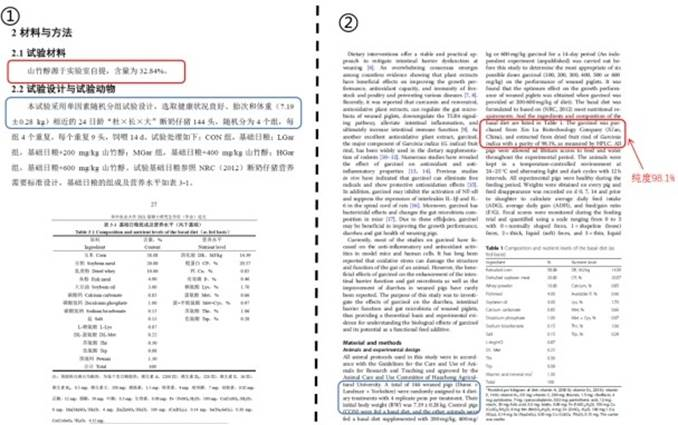

 *图 3-3-1 图①为学位论文的材料与方法部分，图②为 Paper 9 的材料与方法部分*

我们再来看 16S rDNA 测序微生物多样性的结果，从原始报告中我们可以看到检测的样本个数为 13 个，而检测数据同样进行了大量的改动和编造（图 3-3-2 和图 3-3-3）。

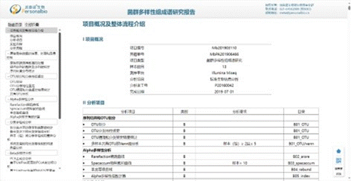

 *图 3-3-2 存档的菌群多样性组成谱研究报告*

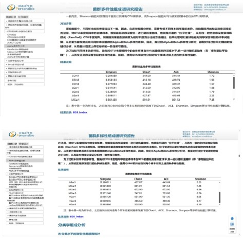

 *图 3-3-3 菌群微生物多样性指数表*

为了方便比较，将检测报告中的菌群 α 生物多样性指数整理汇总，可见报告中有 Con、LGar、MGar、Hgar 三组，每组三个重复（图 3-3-4）。该检测报告数据与 Paper 9 的Table 10（P 9），学位论文表 3-8（P 35）大体吻合，仅改动了 600 mg/kg 的Garcinol 组 Chao1、ACE指数的百位数不同以满足实验预期（如 512.51 变成了 712.51）。但两篇论文都说明了每组样本数 n＝12（四组总数应为 48 个），而报告中检测的样本总数仅为 13 个（图 3-3-5）。

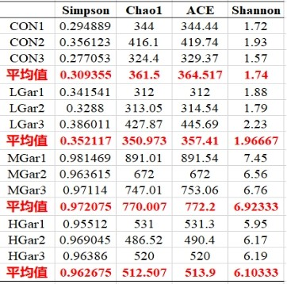

 *图 3-3-4 检测报告中的菌群生物多样性指数*

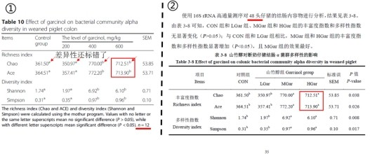

 *图 3-3-5 图①山竹醇对断奶仔猪结肠 α 菌群多样性的影响，图②为山竹醇对断奶仔猪结肠 α 菌群多样性的影响。红色框为更改后的数据，原始检测报告数据为 Chao：512.51；Ace：513.9。图①中还出现了差异性标注规则错误。*

在 Paper 9 的 Fig. 5（P 11），学位论文的图 3-1（P 36）也使用了一模一样的图片展示微生物NMDS 和 PCA 图（图 3-3-6)。

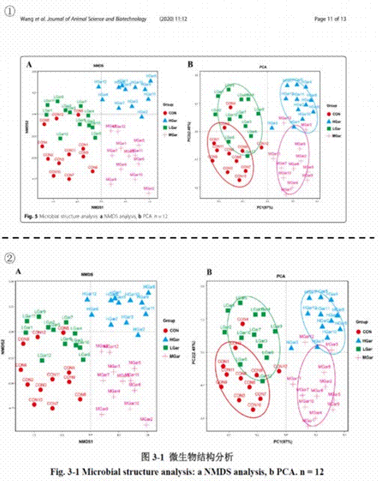

 *图 3-3-6 图①为 Paper 9 的微生物结构分析，图②为学位论文的微生物结构分析。*

如前文所述，在菌群多样性组成谱的原始研究报告中，每组只有三个重复，剩下的点通过作图技巧进行补齐。此外，我们比对发现，在 NMDS 结果中，有两个点相似，用红色方框和蓝色方框标记（图 3-3-7）。在 PCA 结果中，横纵坐标完全相同，有两个点的位置是相似的，用红色方框和蓝色方块匹配标记（图 3-3-8)。

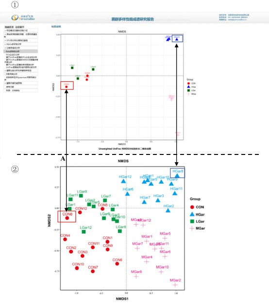

 *图 3-3-7 图①为菌群多样性组成谱原始研究报告的 NMDS 图，图②为 Paper 9 和学位论文所用NMDS 图。*

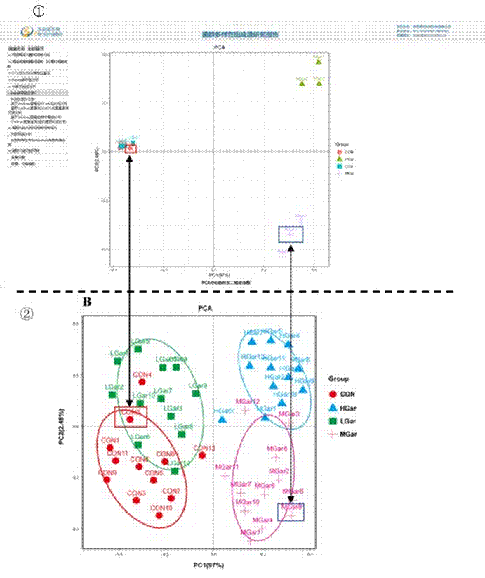

 *图 3-3-8 图①为菌群多样性组成谱原始研究报告的 PCA 分析图，图②为 Paper 9 和学位论文所用 PCA 图。两者横坐标都为 PC1（97%），纵坐标都为 PC2（2.48%）。*

接下来再看生长性能部分，Paper 9 的Table 4（P 5）与学位论文的表 3-4、3-5（P 33、34）展示了山竹醇对断奶仔猪生长性能和腹泻率的影响，在其他数据与 SEM 完全相同的情况下，Paper 9 Final weight（末重）的显著性标注却不同，山竹醇组的 ADFI 也不同，数据再一次被莫名其妙篡改（图 3-3-9）。

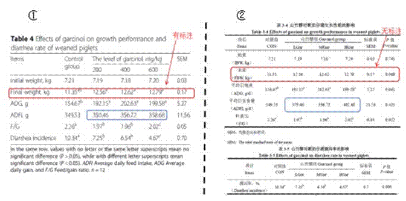

 *图 3-3-9 图①为山竹醇对断奶仔猪生长性能和腹泻率的影响，图②为山竹醇对断奶仔猪生长性能的影响。红框数据为相同的末重，蓝框为不同的 ADFI 值。*

同样，学位论文表 3-6（P 34）与 Paper 9 的Table 6（P 6）的数据完全相同，然而学位论文的回肠隐窝深度 P<0.05，却没有标注差异性（图 3-3-10）。

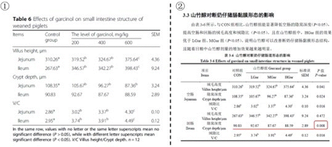

 *图 3-3-10 图①为山竹醇对断奶仔猪小肠结构的影响，图②为山竹醇对断奶仔猪肠粘膜形态的影响。红线标出了学位论文 P\<0.05 却没标注显著性的数据。*

最后就是多处重复使用数据了，在饲料添加剂浓度不同的情况下，学位论文的表 3-7（P 34）与 Paper 9 的 Table 7（P 7）；学位论文的表 3-9（P 38）与 Paper 9 的Table 11（P 10）；
学位论文的图 3-2 到 3-5（P 36-38）与 Paper 9 的Fig. 4（P 11）完全一致（图 3-3-11、图 3- 3-12 和图 3-3-13)。

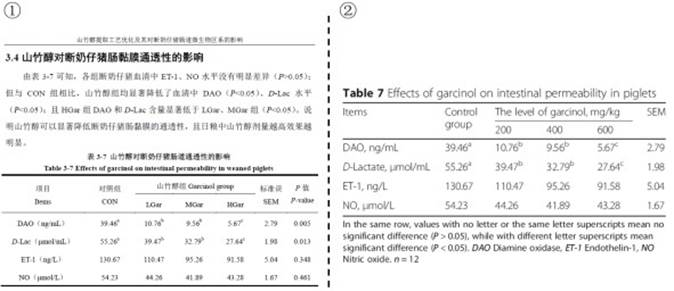

 *图 3-3-11 图①为山竹醇对断奶仔猪肠道通透性的影响，图②为山竹醇对仔猪肠道通透性的影响。*

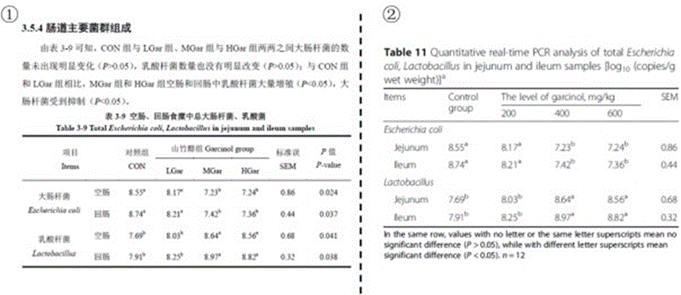

 *图 3-3-12 图①为空肠、回肠食糜中总大肠杆菌、乳酸菌，图②为空肠和回肠样品中总大肠杆菌、乳酸菌实时荧光定量 PCR 分析。*

 *图 3-3-13 图①为日粮添加山竹醇对断奶仔猪结肠微生物群组成的影响，图②为断奶仔猪结肠菌群物种属水平分类柱状图和优势菌群属丰度差异*
