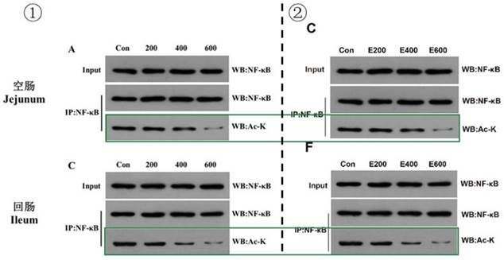
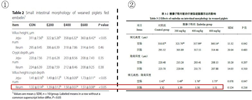

## 3.4   温 S

> Pillar-of-Academic-Shame：[酸藤子酚对断奶仔猪生长性能、肠道炎症及肠道微生物区系的影响 - 中国知网 (cnki.net)](https://kns.cnki.net/kcms2/article/abstract?v=0qMDjMp0v1lVGlW4EZPzaNizwdDxw7l7nFD5CZZyL8FU_UbRWCuDxJUpMMBp-_J2ABEjcq744a27UYsYXojZTxgc5Ccm0KMm8LC-wRi9ejgZ7vI7GIRbh9L7n1RdDh_KVY6d_ygwkTpdI6O5yH-8dA==&uniplatform=NZKPT&language=CHS)

温 S 是黄教授指导的 2022 届硕士毕业生，其学位论文题为《酸藤子酚对断奶仔猪生长性能、肠道炎症及肠道微生物区系的影响》（简称学位论文）。在与姚博士、王博士为共同第一作者于 2022 年 12 月在《Journal of Animal Science and Biotechnology》发表的《Embelin alleviates weaned piglets intestinal inflammation and barrier dysfunction via PCAF/NF-κB signaling pathway in intestinal epithelial cells》（简称 Paper 10）进行比较后我们发现，尽管研究的猪群和饲喂时间不同，但是两篇论文却多处重复使用相同的结果。
首先来看实验设计部分，这两篇论文在猪只的初始体重、试验周期、饲喂的酸藤子酚
（Embelin）纯度并不相同。具体来说，在 Paper 10（见 P 2）中为 160 头 7.05±0.28 kg 的断奶仔猪，试验周期为 2 周，添加纯度 98.1% Embelin（同样价格高昂）；学位论文（见 P 15）的材料方法描述中为 120 头 6.76±0.26 kg 的断奶仔猪，试验周期为 4 周，添加有效含量为
30% Embelin 的提取物。然而两篇论文最终在结果部分却实现了“殊途同归”。

 *图 3-4-1 两篇论文材料与方法对比*

图 ①来自 Paper 10 材料与方法，②来自学位论文材料与方法。
再看学位论文图（图 3-4-2 中②、见 P 29、P 30）展现了断奶仔猪空肠和回肠紧密连接蛋白 WB 图，以及Paper 10 图（图 3-4-2 中①、见 P 6）的结果。显然是将同一结果进行了重复使用。

 *图 3-4-2 两篇论文肠组织紧密连接蛋白表达对比*

图 ①为 Paper 10 中 Fig. 2，②由上自下来自学位论文图 3-6、3-7。
无独有偶，学位论文图（图 3-4-3 中①、见P 31），Paper 10 图（图 3-4-3 中②、见 P 6)展现了空肠和回肠 PCAF 和 NF-κB 的 WB 图，两者依然重复使用了同一 WB 图。

 *图 3-4-3 两篇论文肠组织 PCAF 和 NF-κB 的 WB 图对比*

图①来自学位论文图 3-9，②来自 Paper 10 Fig. 2，绿色方框标记的结果几乎相同。
不仅如此，Paper 10 中许多结果的呈现与学位论文相似中又有可疑的调整。学位论文（图3-4-4 中①、见 P 25）与Paper 10（图 3-4-4 中②、见 P 4）分别展现了 Embelin 对断奶仔猪生长性能和腹泻率的影响，初始体重与末重范围居然极其相似。Paper 10 的初始体重不是
7.05±0.28 kg 吗？为何与初始体重为 6.76±0.26 kg 的猪群具有极其相似的体重数据？然而这
篇 Paper 10 的亮点还在用 2 周的时间就达到了学位论文中 4 周的末重。以此类推，Paper 10 的平均日增重（ADG）应是学位论文中的 2 倍，料肉比（F/G）和日采食量（ADFI）也应有变化，然而，这些数据却与学位论文 1-28 天的数据具有相似的范围。

 *图 3-4-4 两篇论文中断奶仔猪生长性能和腹泻率结果对比*

图①为学位论文表 3-1，②为 Paper 10 Table 1，展现了 Embelin 对断奶仔猪生长性能和腹泻率的影响。使用相同颜色方框标记相似的数据。
学位论文（图 3-4-5 中①、见 P 28）与 Paper 10（ 图 3-4-5 中②、见 P 4）在空肠（Jejunum）炎性因子 mRNA 相对表达水平上，IL-1β，IL-6，IL-10 的柱状图高度达到了奇迹般的相似！ 其中，Paper 10 中 TNF-α 下调了“E600”组，而学位论文中无差异性的 IL-10 mRNA 相对表达，Paper 10 增添了差异性。

 *图 3-4-5 两篇论文断奶仔猪空肠炎性因子 mRNA 相对表达水平对比*

图①来自学位论文图 3-4，展现了断奶仔猪空肠黏膜炎性因子 mRNA 相对表达量，②来自
Paper 10 Fig. 1，展现了断奶仔猪空肠黏膜炎性因子 mRNA 相对表达量。蓝色参考线指出了相同样，在学位论文（图 3-4-6 中①、见 P 29）展现的回肠（Ileum）炎性因子 mRNA 相对表达与 Paper 10（图 3-4-6 中②、见 P 4）的相应结果进行比较，其 TNF-α，IL-6，IL-10 的柱状图高度和趋势相似，我们也用蓝色参考线一一比对。

 *图 3-4-6 两篇论文断奶仔猪回肠炎性因子 mRNA 相对表达水平对比*

图 ①来自学位论文图 3-5，展现了断奶仔猪回肠黏膜炎性因子 mRNA 相对表达量，②来自
Paper 10 Fig. 1，展现了断奶仔猪回肠黏膜炎性因子 mRNA 相对表达量，蓝色参考线指出了相Embelin 几乎统一了两篇文章中断奶仔猪空肠和回肠的绒毛高度和隐窝深度，如此看来饲喂 2 周或者 4 周Embelin 对试验结果几乎没有影响。在学位论文（图 3-4-7 中②、见 P 27） 和 Paper 10（图 3-4-7 中①、见P 5）中，Paper 10 中的数据仅仅是学位论文中的平均数四舍五入后加上标准差所得，并且与学位论文相比再一次调整了回肠中绒毛高度：隐窝深度的差异性。真真假假，假假真真，这样的研究，这样的结果，到底有几分可靠？

 *图 3-4-7 两篇论文断奶仔猪空肠和回肠的绒毛高度和隐窝深度结果对比*

图 ①为 Paper 10 Table 2，②为学位论文表 3-2。红色框标注部分为回肠绒毛高度：隐窝深度，学位论文中 P\ > 0.05，而 Paper 10 中 P\ < 0.05。
而单看学位论文的柱形图，我们意外发现全文中有几张类似的柱形图，放在一起进行比对，横坐标放于水平参考线上，纵坐标调至一致长度，它们从左到右依次来自于学位论文图3-5 回肠黏膜 IL-6 mRNA 表达（见P 29）；图 3-8 空肠 PCAF mRNA 表达（见P 31）；图 3-8回肠 PCAF mRNA 表达（见 P 31）；图 3-9 回肠NF-κB 蛋白活性（见 P 31)。比对发现，四张柱形图存在不同程度的相似。

 *图 3-4-7 两篇论文断奶仔猪空肠和回肠的绒毛高度和隐窝深度结果对比学位论文中存在部分高度相似的柱状图*

总的来说，这篇学位论文与 Paper 10 在猪群的初始体重与 Embelin 饲喂方法上存在差异，生产性能，炎症因子 mRNA 相对表达，肠道黏膜形态，肠道黏膜紧密连接蛋白表达， PCAF 和NF-κB 的结果却“殊途同归”，更是存在可疑的细微差异。