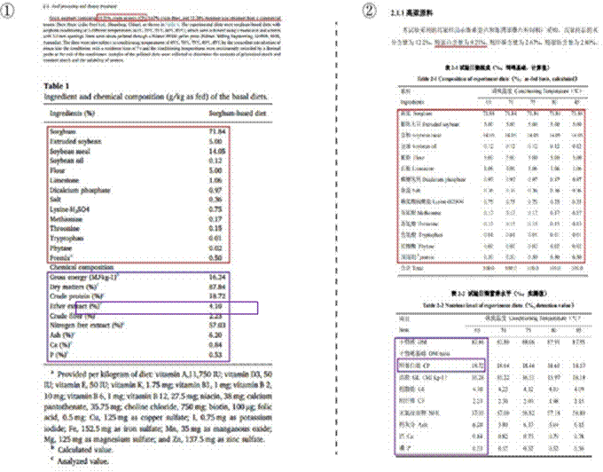
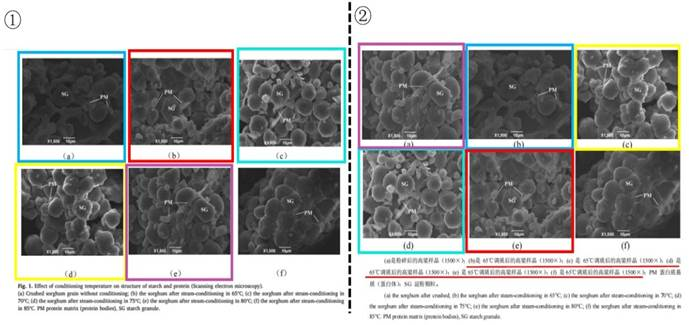
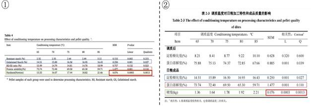
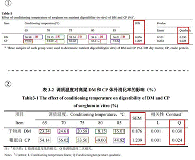

## 3.5   刘 S

刘 S 是黄教授指导的 2017 届硕士毕业生，毕业论文题目为《调质温度对猪高粱型日粮加工特性和养分消化率的影响》（本节中简称学位论文）。将其与王博士以第一作者身份在
《Animal Feed Science and Technology》上发表的《Effect of conditioning temperature on pelleting characteristics, nutrient digestibility and gut microbiota of sorghum- based diets for growing pigs》
（本节中简称 Paper 11）进行对比，在刘 S 非共同作者的情况下，我们发现存在重复用图、用数据甚至改动等重多问题。
如图 3-5-1，在 Paper 11 的材料与方法部分及 Table 1（见P 2 和P 3），使用的高粱样品含 10.21%粗蛋白，2.67%粗纤维，12.20%的水分；而学位论文第二章 2.1 节的材料与方法（见P 18 和P 19）中，使用的高粱样品含 9.21%粗蛋白，2.67%粗纤维，12.20%水分和 2.80%粗脂肪。值得注意的是，尽管基础日粮的组成不同，Paper 11 和学位论文中测定的基础日粮粗蛋白的含量却都为 18.72%。

 *图 3-5-1 图①截自 Paper 11，图②来自于学位论文。红色划线标记了高粱样品营养成分，红色方框标记了试验日粮的组成成分，紫色方框标记了日粮的营养水平中的粗蛋白含量（Crude protein）。*

如图 3-5-2，这两篇论文都呈现了高粱日粮的扫描电镜图。在 Paper 11 的 Fig. 1（见 P 5），展示了未经处理的高粱碎粒以及经 65℃、70℃、75℃、80℃和 85℃调质后高粱的扫描电镜图；在学位论文第二章 3.1 节的图 2-1（见 P 23），展示了粉碎后的高粱以及经 65℃、 70℃、75℃、80℃和 85℃调质后高粱的扫描电镜图。尽管这两个图对应的处理相同，但除了 f 图相同外，其他的图都被混用乱用。具体来说，Paper 11 的图 a、b、c、d 和 e 分别对应于学位论文的图 b、e、d、c 和 a，我们用不同颜色的方框一一配对，但孰真孰假，谁又是抄袭方？恐怕只有当事人心里才清楚了。

 *图 3-5-2 图①为 Paper 11 调质温度对淀粉和蛋白质结构的影响，图②为学位论文高粱样品的扫描电镜图。颜色相同的框代表电镜图相同，在学位论文的中文图注中还误将调制温度都写为65℃。*

如图 3-5-3，在调制温度对高粱日粮加工特性和质量上，Paper 11 的结果也和学位论文高度一致。Paper 11 的 Table 4（见P 6）与学位论文第二章 3.2 节的表 2-3（见P 24），展了调质温度对日粮加工特性和成品质量的影响。对比发现，Paper 11 和学位论文都测定了淀粉糊化度（Gelatinised starch）、蛋白溶解度（Protein solubility）和硬度（Hardness），其中淀粉糊化度和蛋白溶解度的结果完全一致，硬度结果的 SEM 值和 P 值完全一致。

 *图 3-5-3 图①为 Paper 11 调质温度对加工特性和颗粒质量的影响，图②为学位论文调质温度对日粮加工特性和成品质量的影响（颜色相同的框代表相同的测定指标）。*

此外，如图 3-5-4，通过比较 Paper 11 的Table 5（见 P 6）和学位论文第三章 3.3 节的表
3-2（见 P 34），我们可以看到两者都探究了调质温度对高粱 DM 和 CP 体外消化率的影响。
虽然 Paper 11 和论文中的 DM 和 CP 并不完全相同（  仍能看出一些数据高度相似），但 SEM
值和二次相关性却能相同，毫无疑问再次进行了数据篡改，甚至我们都发现了数据篡改的规律（例如 Paper 的几个 DM 值减 10 之后就变成了学位论文中另一个温度的另一个 DM 值了， 请玩“大家来找茬”）。

 *图 3-5-4 图①为 Paper 11 中调质温度对高粱 DM 和 CP 体外消化率的影响，图②为学位论文中调质温度对高粱 DM 和 CP 体外消化率的影响*
