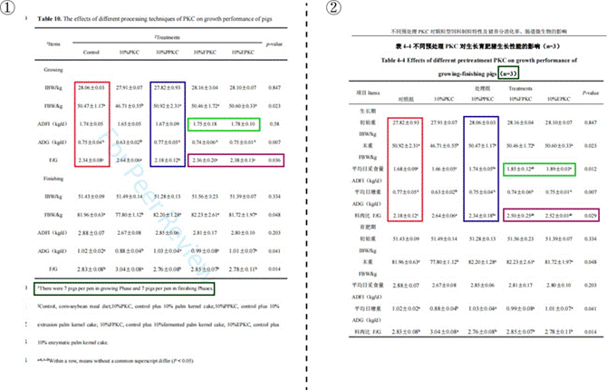

## 3.6   郭 BY

> Pillar-of-Academic-Shame：[不同预处理棕榈粕对颗粒型饲料制粒特性及猪养分消化率、肠道微生物的影响 - 中国知网 (cnki.net)](https://kns.cnki.net/kcms2/article/abstract?v=0qMDjMp0v1l4Vc5VmsiyqyFO4KqR-WfSUOILSN2JU9RpTHWty0OSI-N2-V5S6oNAwasxwB7iBY4O8-WV1dgKyb3UANbWsUG_lfDq-BPpswp6EowbkpaJx99uQkPyPakVD8mFBZ5hqigh6W6RyMwd9g==&uniplatform=NZKPT&language=CHS)

郭 BY 是黄教授指导的 2023 届硕士毕业生，其毕业论文题目为《不同预处理棕榈粕对颗粒型饲料制粒特性及猪养分消化率、肠道微生物的影响》（本节中简称学位论文），与王博士以第一作者身份在《Journal of Animal Science》上发表的《Effects of different processing techniques of palm kernel cake on processing quality of pellet feed, nutrient digestibility, and intestinal microbiota of pigs》（本节中简称 Paper 12）的试验对应。图 3-6-1 中①是 Paper 12 材料与方法部分（见 P 2），图 3-6-1 中②为学位论文第四章 1.1 试验动物与设计部分（见 P 32）。
对比可以发现，尽管 Paper 12 的作者中并无郭 BY，但两篇论文整体试验设计相似（ 仅在试验动物数目方面略有差异，每个组的重复数和每个重复猪的数量都不同）。此外，两篇论文多处重复使用了相同的结果，其中部分结果被改动。

 *图 3-6-1 两篇论文材料与方法对比*

图①为 Paper 12 中材料与方法部分（见 P 2），图②为学位论文中试验动物与设计部分（见 P 32）
图 3-6-2 中①是 Paper 12 的 Table 9（见 P 7），显示了 PKC 不同加工工艺对猪营养物质消化率的影响；图 3-6-2 中②为论文第四章 2.1 节的表 4-3 （见 P 36），显示了不同预处理 PKC对生长育肥猪养分消化率的影响。可以看出两者实验数据基本保持一致，但 CP 组仅对照组数据一致，不同组差异显著性也出现较大改变，后续的结果也多次出现这种现象，无法探究究竟谁才是真实数据。

 *图 3-6-2 两篇论文中猪养分消化率结果对比*

图①为 Paper 12 中 PKC 不同加工工艺对猪营养物质消化率的影响（见 P 7），图②为学位论文中不同预处理 PKC 对生长育肥猪养分消化率的影响（见 P 36）
再看两篇论文中不同预处理 PKC 对生长育肥猪生长性能的影响（图 3-6-3）。首先可以看出在两者样本量不同的情况下，多处重复使用了数据。当然最有趣的还是将两篇文章中生长期的对照组和 10%PPKC 组数据直接进行了对换（图 3-6-3 中红框和蓝框中内容）。

 *图 3-6-3 两篇论文中猪生长性能结果对比*

图①为 Paper 12 中 PKC 不同加工工艺对猪生长性能的影响（见 P 8），图②为学位论文中不同预处理 PKC 对生长育肥猪生长性能的影响（见 P 37）
两篇论文中不同预处理PKC 对生长育肥猪血液生化指标的结果也非常有趣（图3-6-4），在大体数据保持一致的情况下，莫名又将三个处理组的白蛋白含量+1（红框框出)，彰显卓越的“数据处理”能力。

 *图 3-6-4 两篇论文中猪血液生化指标结果对比*

图①为 Paper 12 中 PKC 不同加工工艺对血液指标的影响（见 P 8），图②为学位论文中不同预处理 PKC 对血液指标的影响（见 P 38）