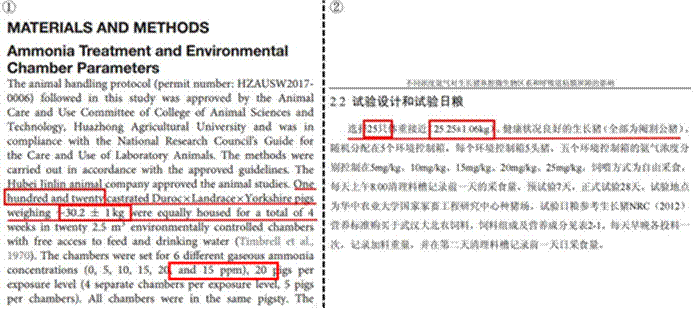
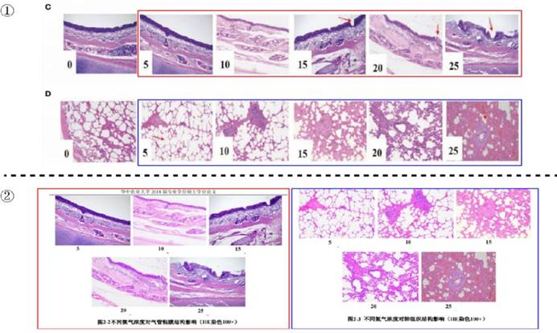
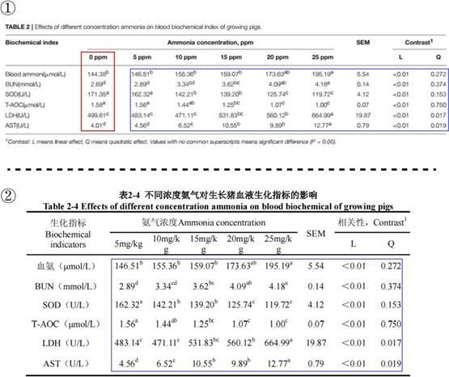

## 3.7   李 J

李 J 是黄教授指导的 2018 届硕士毕业生，其毕业论文题目为《不同浓度氨气对生长猪鼻腔微生物区系和呼吸道粘膜屏障的影响》（本节中简称学位论文）。将其学位论文与王博士以第一作者身份于 2019 年 5 月在《Frontiers in Microbiology》上发表的《The Variation of Nasal Microbiota Caused by Low Levels of Gaseous Ammonia Exposure in Growing Pigs》（本节中简称 Paper 13）对比，我们发现同样存在实验设计不同但数据重复使用等现象。
如图 3-7-1，图①为 Paper 13 中材料与方法部分（见 P 2），图②为学位论文中第二章 2.2试验设计和试验日粮部分（见P 15）。通过对比可以发现，两者在试验动物的数量和体重上存在差异。Paper 13 中使用了 120 只体重为 30.2±1kg 的阉割公猪，而学位论文使用的则为25 只体重为 25.25±1.06kg 的阉割公猪。此外，两者试验设计的分组也不同，Paper 13 比学位
论文多了一个对照组，即氨气浓度为 0 的组（Paper 13 中 “25”还写错成 “15”）。尽管试验动物存在差异，但两篇论文的结果中存在许多完全相同的现象。

 *图 3-7-1 图①截取于 Paper 13 中的材料与方法（P 2）；图②截取于学位论文中第二章 2.2 的材料与方法（P 15）*

如图 3-7-2，图①是 Paper 13 中Fig. 5 的图 C 和D（见 P 9），展示了不同浓度氨对生长猪气管黏膜和生长猪肺组织形态的影响；图②是学位论文第二章 3.3 节的图 2-2 和图 2-3（见P 20），展示了不同氨气浓度对气管粘膜和肺组织结构影响。图中可以很明显地看出，这两者对应的图是完全相同的，但是前文提到过的，Paper 13 和学位论文使用的实验动物是有区别的。不同的试验动物得到相同的结果真是让人匪夷所思。

 *图 3-7-2 上侧图①为不同浓度氨对生长猪气管黏膜和生长猪肺组织形态的影响；下侧图②为不同氨气浓度对气管粘膜和肺组织结构影响（颜色相同的框代表相同的图）*

如图 3-7-3，图①截取于 Paper 13 的 Table 2（见 P 11），显示了不同浓度氨对生长猪血液生化指标的影响；图②截取于学位论文第二章 3.2 节的表 2-4 （见 P 19），显示了不同浓度氨气对生长猪血液生化指标的影响。对比发现，Paper 13 和学位论文中对应组的结果完全一致，而在 Paper 13 多了一个 0 ppm 氨气组的情况下，Paper 13 和学位论文的 SEM 值、L 值和Q 值还能完全相同。如图 3-7-4，图①为 Paper 13 中 Table 3（见 P 11）不同浓度氨气对生长猪气管相关基因表达量的影响；图②为硕士论文第二章表 2-5（见 P 21）不同浓度氨气对生长猪气管相关基因表达量的影响，在不同浓度氨气对生长猪气管相关基因表达量影响的结果这部分也出现了上述同样的情况。

 *图 3-7-3 图①为不同浓度氨对生长猪血液生化指标的影响；图②为不同浓度氨气对生长猪血液生化指标的影响（颜色相同的框代表相同的数据）*

 *图 3-7-4 上侧图①为 Paper 13 中 TABLE3 不同浓度氨气对生长猪气管相关基因表达量的影 响；下侧图②为学位论文第二章表 2-5 不同浓度氨气对生长猪气管相关基因表达量的影响（颜色相同的框代表相同的数据）*
