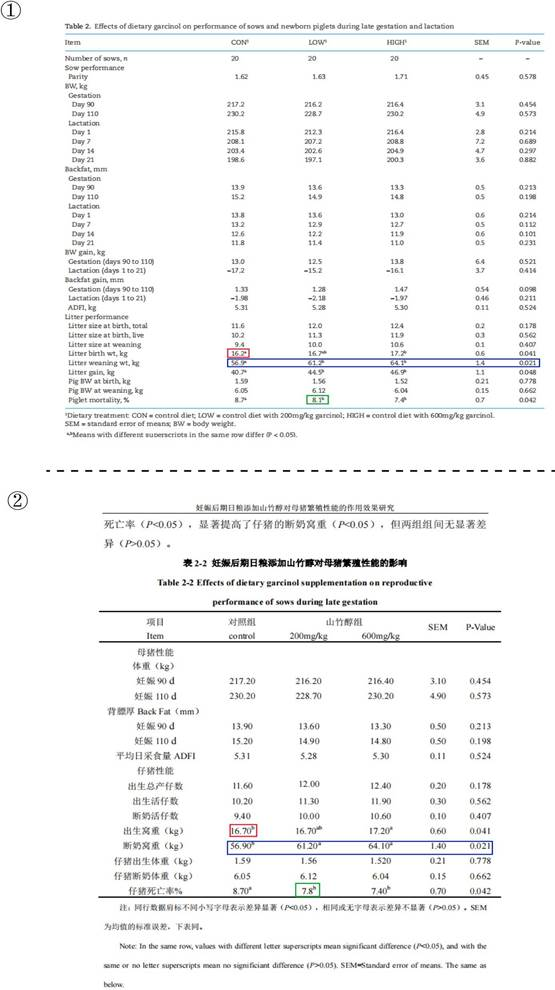
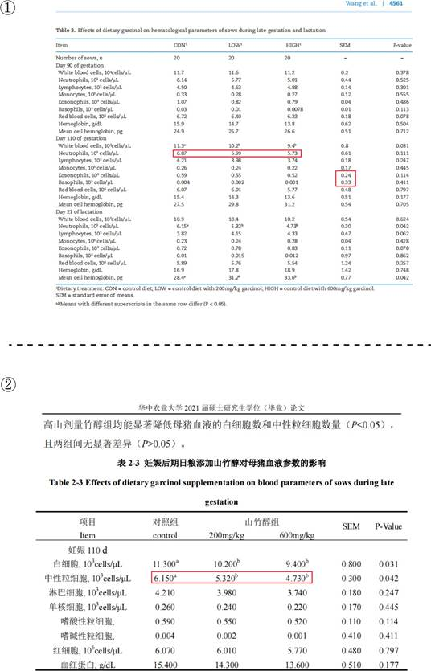
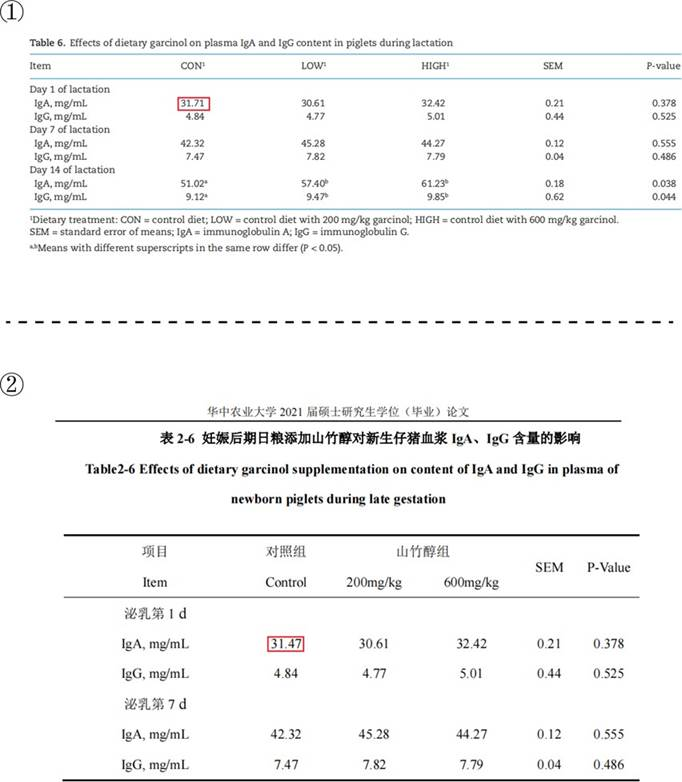
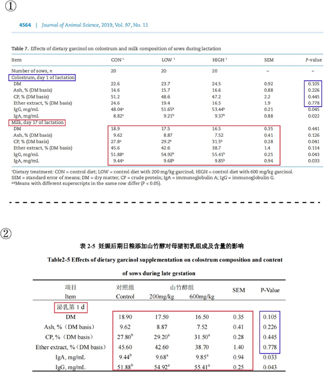

## 3.8   夏 J

> Pillar-of-Academic-Shame：[妊娠后期日粮添加山竹醇对母猪繁殖性能的作用效果研究 - 中国知网 (cnki.net)](https://kns.cnki.net/kcms2/article/abstract?v=0qMDjMp0v1lV4LZLB8LRi_K8JEsCF9POeoU2q7J-JWop4PVCh17YJIq8KsR3uIaZXn0c0wgfZG_lObzTeCAyJhlfSyQdWDZFMmUq9JUlLec4nBQ_0vWbWf8ZMifQtJzvB8AmOgQCJcL88lDIJNRVhQ==&uniplatform=NZKPT&language=CHS)

接下来我们对比黄教授 2021 届硕士毕业生夏 J 的毕业论文《妊娠后期日粮添加山竹醇对母猪繁殖性能的作用效果研究》（这部分中简称学位论文）和王博士为第一作者于 2019 年发表于《Journal of Animal Science》的学术论文《Dietary supplementation with garcinol during late gestation and lactation facilitates acid–base balance and improves the performance of sows and newborn piglets》（这部分中简称 Paper 5），夏 J 为 Paper 的第三作者。
如图 3-8-1，在 Paper 5 中，Table 2 展示了妊♘后期和泌乳期日粮添加山竹醇对母猪和
新生仔猪的影响（见 P 4560），学位论文的表 2-2 展示的妊♘后期日粮添加山竹醇对母猪繁殖性能的影响（见P 17）。两者结果高度一致，但通过对比，我们发现其学位论文在撰写时修改了部分数据及显著性，见两幅图中相同颜色的方框。

 *图 3-8-1 图①截取自 Paper 5，图②截取自学位论文*

如图 3-8-2，相同的情况还出现在其学位论文的表 2-3 妊♘后期日粮添加山竹醇对母猪血液参数的影响（见 P 18）中，对应 Paper 5 中的 Table 3（见 P 4561）。可以观察到修改后的数据由不显著变为显著，甚至在不修改平均值和 P 值的情况下，修改了 SEM 值，如图中红框所标出的数据。

 *图 3-8-2 图①截取自 Paper 5，②截取自学位论文*

如图 3-8-3，学位论文表 2-6 妊♘后期日粮添加山竹醇对新生仔猪血浆 IgA、IgG 含量的影响（见P 20）中泌乳第 1d 的对照组 IgA 浓度也发现了修改，对应 Paper 5 的 Table 6，见图中红框标出部分。

 *图 3-8-3 图①截取自 Paper 5，②截取自学位论文*

最为有趣的是，如图 3-8-4，在其学位论文表 2-5 妊♘后期日粮添加山竹醇对母猪初乳组成及含量的影响结果中（见P 19），分别使用了 Paper 5 结果部分 Table 7（见 P 4564)的泌乳第 17 天的平均值和 SEM 以及第一天结果的 P 值，将两部分的结果进行了糅合，见图中红色和蓝色方框所标部分。

 *图 3-8-4 图①截取自 Paper 5，②截取自学位论文*
