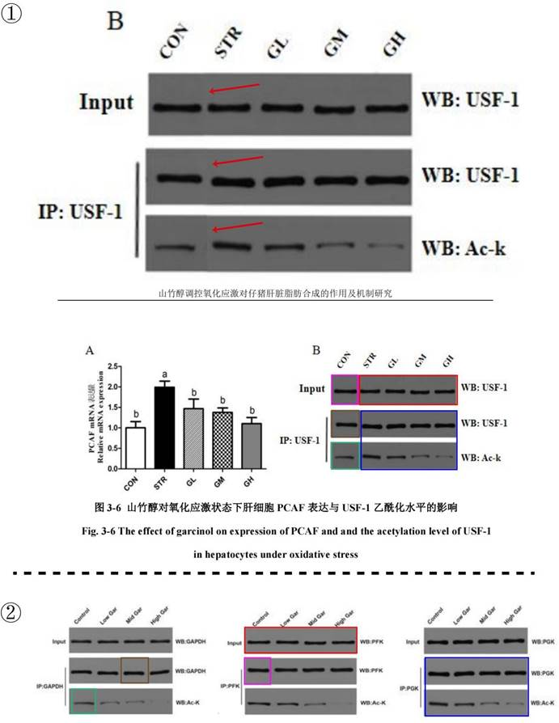

## 3.9   贺 QY

> Pillar-of-Academic-Shame：[亮氨酸调控猪肝脏氨代谢的作用机制研究 - 中国知网 (cnki.net)](https://kns.cnki.net/kcms2/article/abstract?v=0qMDjMp0v1nYQNbgB5M_KrwFFRilHYDjtM38iHVsDQFuadD_fRKN8dGUcj93CV4EWu5ABu4pJcxhvOa0co1gkpkxbAQuzYiDPiUinXwkIUwzI_JzrlHA3C7KEv4xKnGZVqyNCAM-D0KR7b9NHtqw1w==&uniplatform=NZKPT&language=CHS)

贺 QY 是黄教授指导的 2020 届硕士研究生，其学位论文题目为《山竹醇调控氧化应激对仔猪肝脏脂肪合成的作用及机制研究》（这部分中简称硕士论文）。我们对比了硕士论文和姚博士的学位论文《山竹醇调控妊♘后期母猪肝脏丙酮酸代谢的作用机制研究》（这部分中简称博士论文），尽管两篇论文的实验内容完全不同，但我们发现其中存在一些 WB 图完全相同的情况。在前文的描述中，我们已经普遍观察到了 WB 图的误用和滥用，但在这个案例中，WB 图甚至被肆意拼接，毫不在意蛋白是否相同。
如图 3-9-1 所示，图①为硕士论文第三章 3.7 节图 3-6（见P 39），展示了山竹醇对氧化应激状态下仔猪肝细胞 USF-1 乙酰化水平的影响；图②是博士论文第四章 3.7 节图 4-6 的WB 图（见 P 72），展示了山竹醇对妊♘期大鼠肝脏 GAPDH、PFK 和 PGK 的乙酰化水平的影响。通过对比，我们发现硕士论文中的 WB 图都能在博士论文中找到（箭头指的部分存在明显的拼接痕迹），尽管我们无法确定到底是谁使用了谁的图，但这些图完美地展现了黄教授指导学生在图片拼接技术和充分利用资源方面的高超能力。

 *图 3-9-1 图①为山竹醇对氧化应激状态下仔猪肝细胞 USF-1 乙酰化水平的影响，图②为山竹醇对妊♘期大鼠肝脏 GAPDH、PFK 和 PGK 的乙酰化水平的影响（颜色相同的框代表相同的图）*
