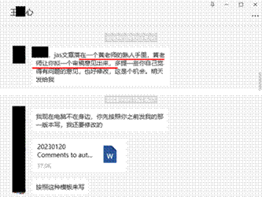
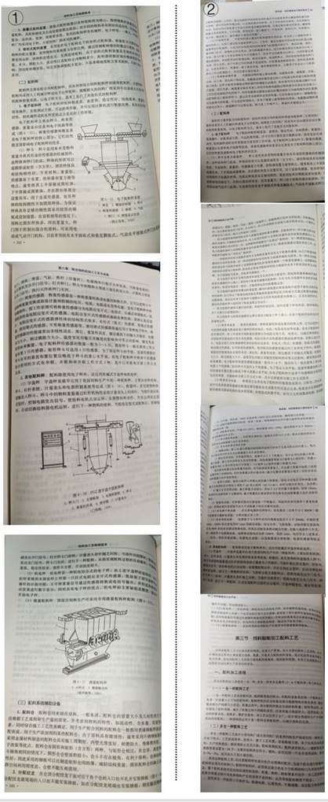

# 4   黄教授其余行为总览

## 4.1   操纵同行评审

在王博士以共同第一作者（排名靠前）的身份发表在《Journal of Animal Science》的文章《Dietary supplementation with garcinol during late gestation alleviates disorders of bile acid metabolism and improves the performance of sows and newborn piglets》中，我们不难察觉到他对于发表文章的随意态度。他不仅肆意篡改和编造实验数据，还操纵同行评审以便顺利发表自己的研究成果。
这篇文章中的所有实验结果都来自一个名为“回来了”的 Word 文档，而关于这些结果是如何得到的，由谁进行的实验和数据检测，却无人得知。我们所能看到的只是事先计算好的“平均值±SEM”和完全符合实验预期的“P 值”。当然，读到这里的大家对于这种情况已经司空见惯了（见图 4-1-1）。

 *图 4-1-1 部分聊天记录*

而更令人瞠目结舌的是，就连操纵同行评审也可以这样轻描淡写的说出“让你拟一个审稿意见出来”、“这是个机会”等话语（见图 4-1-2）。这让人不禁思考，这种“自问自 答”式的同行评审是个“偶然”，还是 SCI 写手的“常态”？

 *图 4-1-2 部分聊天记录*

对于即将接收的文章，王博士的态度更是十分随意。原文件找不到了？没关系，按照趋势再做一个就好了，“不一定要完全一致，但是大体上要看不太出变化，编辑一般不看，不用太严苛”（见图 4-1-3)。

 *图 4-1-3 部分聊天记录*

## 4.2   克扣学生劳务费

黄教授在劳务费方面也是能省则省。根据我校现行的研究生学费与奖助学金办法中第六条规定：研究生导师为所招收的全日制研究生发放助研津贴。助研津贴最低标准为自然科学类博士研究生每生每月 600 元，硕士研究生每生每月 200 元；人文社科类博士研究生
每生每月 500 元，硕士研究生每生每月 150 元，按每年 12 个月发放（见图 4-2-1）。但是黄
教授视若无物，从未按照 12 个月的标准来为学生发放劳务费，负责报账的同学曾反映过这个问题，得到的回复是“有意见的来我办公室找我”（见图 4-2-2）。黄教授曾直言：“现在的学生不懂感恩

 *img*
，我给他们读书的机会，他们还跟我要钱！”
图 4-2-1 我校现行的研究生学费与奖助学金办法部分截图

 *图 4-2-2 财务系统的劳务费发放记录*

## 4.3   打压学生

从入学开始，黄教授就利用他作为导师的权力来操控和打压那些表达不同意见的学生。他表面上会支持学生自己找课题，但无论学生找什么都会全盘否定，随后指定学生随便做个课题，这也是为什么前文中许多人重复利用和编造数据的重要原因之一。当然，也有学生诚实地呈现出不显著的结果，立马就会遭到黄教授以及王、姚两位博士的轮番攻击，以“根本不懂数据统计”、“数据分析全是错的”、“不显著你怎么毕业”等为由，强迫学生按照他们的要求篡改成“完美的数据”。
在开题答辩、中期答辩和毕业答辩上，多次有评委老师提出过 “没见过这么完美的数据”，当然，很少有老师能想到这些数据都是编造而来的吧。在 2023 届毕业答辩时，有位评委老师多次提出质疑，认为我们组毕业生“数据有问题”，更是说出了“要是我拿去做的不好我可得索赔”。这时黄教授会立马与学生划清界限，强调他对学术要求有多么严格，这都是学生不听他的话才“统计错了”，甚至主动给评委老师建议让学生延期。站在台上的学生面对自己导师的批评时，想起自己不得已捏造的数据，那该有多么愤怒和委屈啊。而就在前不久的中期答辩，更是有学生展示的生长猪背膘厚远远高于土猪，这般离谱的数据都勇于在中期答辩中展示出来，想必参与的同学和老师们还历历在目吧。
在平时“学习生活”中，黄教授对学生指导甚少，基本仅限于论文格式问题和 PPT 制作，对学术方面则关注甚少。明明学生已经汇报过的大纲，下一次汇报却被说成“全错”，要求学生多次修改，在论文格式和 PPT 格式上反复做文章。此外，还会指责学生“不及本科生”、“脑子不正常”、“只顾着长肉不长脑子”等。还有学生因正常上课无法参加组会而请假， 会被称为“脱节”，要其做好延毕的准备，逼得学生不得不每次翘课参加组会。
学生们也被黄教授及两位博后统称为“下面的人”，日常的拿寄快递、跑腿、接人什么的就不多说了，改卷评分、做 PPT、写材料和文章什么的现在也很常见，但身为党支部书记， 连党支部党建工作汇报、学习心得等也让学生代劳这就是党性问题了。一旦学生推辞或未按照他们的进度完成任务，就直接以延期毕业威胁。几乎每个同学都成为他们写文章和学术造假的工具。但即使顺从他们的要求，也只能少受指责而已，没有任何回报。部分被分配写文章的学生，在将写好的文章交给王、姚二人后，发表的文章甚至没有学生自己的名字，都拿去给一些不相干的人署名了。此外，他们经常不提供结果或 P 值就要求学生就进行论文撰写。当学生询问如何描述结果时，他们会说：“你想怎么写就怎么写，怎样好讨论就怎么标”、“结果要显著来显出我们的研究有意义”。如果文章投稿后需要补充数据，就随便编造或混淆，一旦期刊社要求提供原始数据，就换个期刊投稿。而在碰到严格的期刊时，也被严厉的词汇拒稿过： “difficult to access”、 “serious concern”、 “significant doubt” （图 4-3-1）。如此看来，这样的文章不挂名才是幸事！

 *图 4-3-1《Animal》杂志拒稿信*

此外，黄教授经常根据自己的臆想散布谣言。例如，我们组因不愿造假而退学的那位博士，在其口中成了“从外面来只想个混学位，受不了严格管理就自己退了。”；在组会上当众嘲讽下场的一个学生心理脆弱，“闹绝食”、“和场里的员工打架”、“天天打电话哭 诉”；最离谱的莫过于还造谣一位已毕业的女学生因不听从他的话而导致“流产”。

## 4.4   论文不当署名

根据我校学术不端行为的认定，明确表明“不当署名”为学术不端行为（见图 4-4- 1）。但黄教授视为无物，其发表论文里经常会给一些毫不相关的本科生署名，甚至带上其家属，这里选取部分乱著名现象进行展示（见图 4-4-2）。

 *图 4-4-1 我校现行学术不端行为认定部分截图*

 *图 4-4-2 用红色方框标记了不当著名*

## 4.5   教材编写造假

黄教授也曾出版过几本著作，其中最具代表性的是作为“十四五”普通高等教育本科规划教材新农科“智慧农业”专业系列教材《饲料智能加工生产学》的主编，这本书的副主编是王博士和姚博士。然而实际上他们并没有亲自参与到写作和修订的过程中，而是将这项任务分配给了学生，要求每个人负责撰写书中的一个章节，并完成最后的校对和修改工作。历时一年多，这本书终于出版，然而却与学生毫无关系，连致谢都未提及，学生们彻底成为了“无名之辈”。
当学生们刚开始接到分配写书的任务时，他们感到非常自豪，因为有机会参与到“十四五”规划教材的创作中，以为可以在学术上做出有意义的贡献。然而，直到学生们真正开始写作时，才意识到他们所谓的“写书”到底是如何进行的。姚博士直接道：去图书馆借几本与饲料加工相关的书籍，然后拍照提取其中的文字，复制粘贴到书中，并嘱咐要多借几本书，轮换使用，不要只依赖一本书的内容。这一刻，编写教材的神圣感被彻底打破了，更何况这是“十四五”规划的教材，谁能接受如此随意的抄袭行为。
再看一下这本书的题目《饲料智能加工生产学》中的“智能”一词，仔细阅读全书后，不难发现，实际上这本书其实与“智能”并无太多关联。
图 4-5-1 中的聊天记录了姚博士将写书的任务按章节进行分配，并且让学生们去图管借书直接抄袭，最后书的修订也全是由学生们完成的，他们三人所做的就是将编辑意见转发，让学生根据意见修改。图 4-5-2、4-5-3、4-5-4 是截取的此书抄袭的部分内容，参考文献中未曾将其列出。

 *①章节任务分配     ② 书的内容修订     ③ 书的内容修改   ④ 书里编写重复的部分*

图 4-5-1 关于写书的部分聊天记录，让学生直接去图书馆借书替换内容

 *图 4-5-2 与张丽英主编《饲料分析及饲料质量检测技术》重复的部分内容，图①为张丽英主编书的部分内容。图②为《饲料智能加工生产学》内容。*

 *图 4-5-3 此书与马永喜主编《饲料加工工艺学》重复的部分内容，图①为马永喜主编《饲料加工工艺学》。图②为《饲料智能加工生产学》内容。*

 *图 4-5-4 此书与冯定远主编《饲料加工及检测技术》重复的部分内容，图①为冯定远主编《饲料加工及检测技术》，图②为《饲料智能加工生产学》内容。*

## 4.6   异常发票

有趣的是，在这样一个科幻的实验室，却经常能收到购买试剂耗材、检测样品、维修仪器设备的发票用于报销，然而，这些购买的材料却在实验室中难见踪迹，我们根本不知这些购买的这些试剂耗材究竟流向何方。尽管时常报销试剂盒等试剂耗材的发票，本组的学生仍只能去别的实验室借用试剂、仪器来进行最基本的检测实验；在收到高额委托检测费用发票的情况下，本实验室的学生还要因检测数目不够将数据进行“二次加工”。
而每当自己的学生自费购买了材料之后需要报销，总会遇到重重阻碍。先是说这类发票不符合规定不能报销，再来就是让学生自己先统计一下总共垫付了多少，做成表格再提交给黄教授审核，最后即便是提交了汇总表格，也像石沉大海一样再也不会有报销的消 息。很多已经毕业的学生手上都还有当时没能报销下来的收据，多么让人无奈。
另外，对于学院经费黄教授也是秉持“不浪费”的理念。学院用于教师队伍建设、学系建设、院系发展的经费设置有一定的金额额度，而黄教授每次报销的发票，都能够完美符合分配额度，一分不多一分不少。报给学院的过程中也不禁令人感叹，这是根据发票报销，还是根据经费额度开的发票？
黄教授手握“国家自然科学基金”和“国家重点研发计划”等项目，经费充裕，但实验做不了、劳务费发的少，那么项目经费究竟都花到了什么地方？我们恳请相关部门能够深入调查，不要让国家用于支持科研发展的经费不知所踪！

## 4.7   教学不端

当谈到黄教授的教学情况时，一眼望去荣誉满身，诸如国家级、省级教学成果、教学质量优秀、教学能手等都尽纳囊中。那么实际情况又是如何呢？
在授课形式上，黄教授通常采用的都是 B 站视频形式，且都是现找现放。B 站视频都看完后，黄教授美名其曰“锻炼同学们的学习能力”，就让学生们上课进行 PPT 汇报。
除了上述情况，黄教授还存在更为严重的教学问题。在 B 站视频和PPT 汇报的影响下， 学生们本来就无法从中获取任何知识，却竟然能够顺利通过期末考试，这完全依赖于黄教授的“妙招”。黄教授经常以划重点的名义，直接给学生们提供题目答案。例如，在给生科院2018 级上动物生产学课程时，黄教授直接泄露了题目答案，选择题更是可以直接背选项； 此外，在动物生产学实习课上，他要求所有学生抄袭同一份实习报告以应付考核。类似的事情还有很多，黄教授从未考虑过对求知欲望强烈的学生们造成的负面影响。

## 4.8   欺骗本科生

黄教授将能够争取到的资金全部纳入自己的囊中，这一点在本科生项目经费上表现得淋漓尽致。每年都会有本科生带着学习实验操作和参加项目等目的前来黄教授的课题组，申请各种项目，如大学生科技创新资金（SRF）、湖北省大学生创新创业训练计划、国家级大学生创新创业训练计划等。然而，黄教授往往会指派研究生稍微修改一下自己的开题的内容，然后就给本科生去申请项目，还美其名曰“课题早就为你们定好了”，让不知情的本科生感恩戴德。
在项目申请成功后，黄教授都会第一时间凑好发票，让本科生拿去报账，一般经费批下来没两天就报的干干净净，实现“精准报销”。然后可怜的同学们在这也没学到什么实验操作，毕竟我们自己都没有什么实验可做。最后，黄教授会在文章中不当署名，甚至是在本科生根本不知情的情况下就在期刊论文中给本科生署名，然后吹嘘自己带领他们发表 SCI。更为可悲的是，如前所述，这些论文本身就存在严重的造假问题。如此诓骗经费，浪费资金的行为，将学生的科研热情置于何地，将学术道德置于何地，将纳税人的血汗钱置于何地？