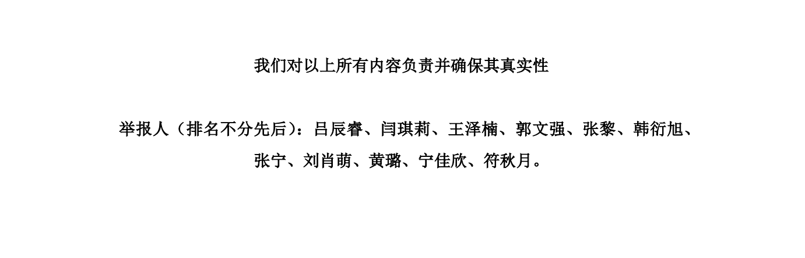

# 联合实名举报 211 高校华中某业大学动物 Y 养系黄某若教授学术造假行为

作者：华中某业大学动物 Y 养系黄某若教授课题组硕士、博士研究生集体 （11 人） 

**举报人（排名不分先后）：吕辰睿、闫琪莉、王泽楠、郭文强、张黎、韩衍旭、张宁、刘肖萌、黄璐、宁佳欣、符秋月。**

华中农业大学 黄飞若

知乎话题：[如何看待211高校华中某业大学动物Y养系黄某若教授十几年如一日的学术造假行为？ - 知乎 (zhihu.com)](https://zhuanlan.zhihu.com/p/678136207)

内容目录：

[0 动态跟踪(补充材料)](0%20动态跟踪(补充材料))

[1 前言](1%20前言)

[2 博士](2%20博士)

[3 硕士](3%20硕士)

[4 黄教授其余行为总览](4%20黄教授其余行为总览)

[5 讨论](5%20讨论)

[6 结语](6%20结语)

[7 致谢](7%20致谢)

附详细内容（正文+附加材料）已上传至网盘：

1.链接：[https://pan.baidu.com/s/1EF_icbpJI1nZ2GEHduQJcQ?pwd=8888]([百度网盘-链接不存在 (baidu.com)](https://pan.baidu.com/s/1EF_icbpJI1nZ2GEHduQJcQ?pwd=8888)) 提取码：8888

2.微软（可能要上网工具才能打开）[https://1drv.ms/f/s!AqiAkeBMS0A](https://1drv.ms/f/s!AqiAkeBMS0A)
